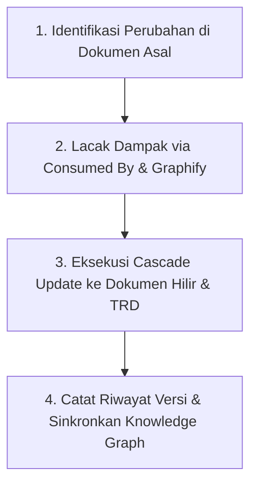

# Change Impact Synchronizer & Traceability Skill

This skill governs how to manage, trace, and cascade changes across the **Smart Environment Health System (SEHS)** documentation ecosystem to ensure that when any business rule, feature, or technical architecture is modified, all correlated documents remain 100% synchronized.

---

## 1. The Core Philosophy: "Zero Documentation Drift"

In an interconnected multi-tier documentation system (Master PRD $\rightarrow$ Feature PRD $\rightarrow$ Master Data $\rightarrow$ Operational PRD $\rightarrow$ TRD/DRA):
* **No document is an isolated island.**
* Any change in an upstream business rule (PRD) MUST immediately reflect on its downstream business modules and technical implementation specs (TRD/DRA).
* Any constraint discovered during technical architecture (TRD/DRA) that affects user experience MUST be fed back and synchronized into the corresponding PRD.

---

## 2. Standard 4-Step Cascade Update Workflow

When a change request, feature adjustment, or bug fix is proposed for an existing document (e.g., `Document X`):



### Langkah 1: Identifikasi & Update Dokumen Asal
1. Terapkan perubahan pada dokumen yang bersangkutan.
2. Naikkan nomor versi dokumen (misal: `v1.0.0` $\rightarrow$ `v1.1.0` untuk perubahan minor/aturan bisnis baru, atau `v2.0.0` untuk perombakan besar).
3. Catat ringkasan perubahan pada tabel metadata dokumen.

### Langkah 2: Lacak Dampak (Impact Traceability Analysis)
1. **Cek Baris `Consumed By (Dampak)`:** Buka bagian atas dokumen asal dan salin daftar seluruh file yang mengonsumsi dokumen ini.
2. **Cek Graphify AI:** Jalankan query untuk mendeteksi relasi tidak langsung yang berpotensi terlewat:
   ```bash
   graphify query "Apa saja yang terhubung dan terdampak oleh perubahan pada [Nama Modul]?"
   ```

### Langkah 3: Eksekusi Cascade Update (Penyelarasan Hilir)
1. Buka setiap dokumen hilir yang terdaftar di `Consumed By`.
2. Sesuaikan narasi alur, validasi form, atau penanganan kasus khusus (*edge cases*) agar selaras dengan aturan baru.
3. Buka dokumen teknis terkait di folder `technical/` (TRD / DRA):
   * Jika ada penambahan atribut bisnis di PRD $\rightarrow$ tambahkan kolom / tipe data / enum di DRA Database.
   * Jika ada perubahan alur di PRD $\rightarrow$ sesuaikan request/response payload di TRD API Specs.

### Langkah 4: Sinkronisasi Knowledge Graph & Commit
1. Setelah seluruh dokumen yang berkorelasi selesai diselaraskan, jalankan:
   ```bash
   graphify update .
   ```
2. Lakukan commit perubahan ke Git dengan pesan deskriptif (misal: `docs(change): cascade update room risk classification across PRD and DRA`).

---

## 3. Aturan Pemetaan Kode Aturan Bisnis (Traceability ID)

Setiap aturan bisnis di PRD wajib menggunakan kode unik terstandar:
* `BR-AUTH-XX`: Aturan Autentikasi & Akun
* `BR-MD01-XX`: Aturan Master Organisasi & Shift
* `BR-MD02-XX`: Aturan Master Fasilitas, Ruangan & QR Code
* `BR-MD03-XX`: Aturan Master Standar Checklist
* `BR-MD04-XX`: Aturan Master Limbah & TPS
* `BR-MD05-XX`: Aturan Master Kualitas Air & Udara
* `BR-MD06-XX`: Aturan Master Kategori Temuan & SLA
* `BR-OP01-XX` s/d `BR-OP05-XX`: Aturan Modul Transaksi Operasional

**Di dokumen teknis (TRD/DRA):** Setiap tabel, kolom khusus, atau endpoint API wajib mencantumkan komentar acuan kode aturan bisnis ini, contoh:
```sql
-- BR-MD04-03: Alarm jika akumulasi limbah TPS >= 80%
warning_threshold_percentage DECIMAL(5,2) DEFAULT 80.00 NOT NULL,
```

---

## 4. Checklist Kesiapan Penyelarasan (Verification Gate)

Sebelum menandai tugas perubahan selesai, agen/developer wajib memastikan:
* [ ] Dokumen asal telah diperbarui dan nomor versinya dinaikkan.
* [ ] Seluruh dokumen pada baris `Consumed By` telah diperiksa dan disesuaikan.
* [ ] Dokumen teknis (TRD/DRA) telah mencerminkan aturan bisnis baru.
* [ ] Navigasi di `README.md` tetap akurat dan tidak ada link rusak (*dead link*).
