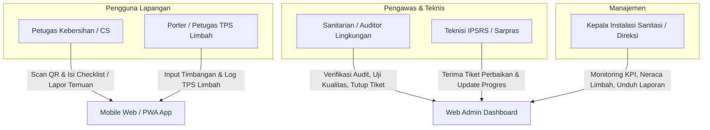
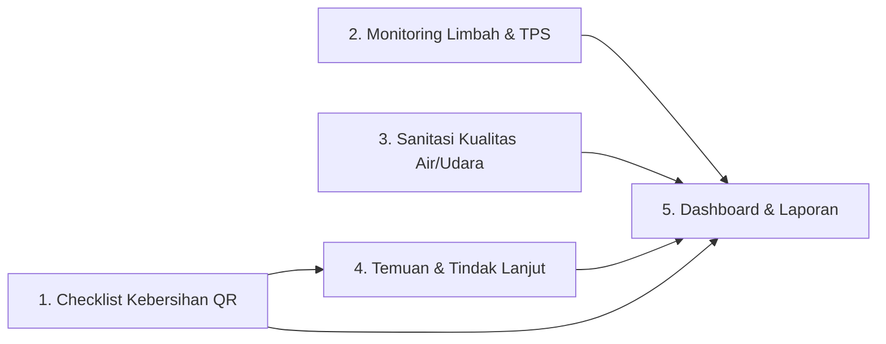
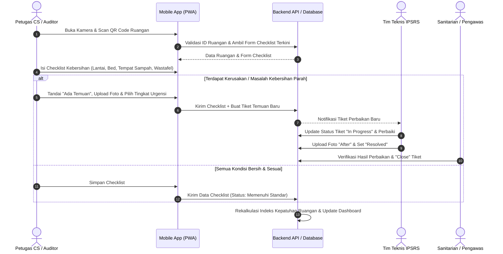
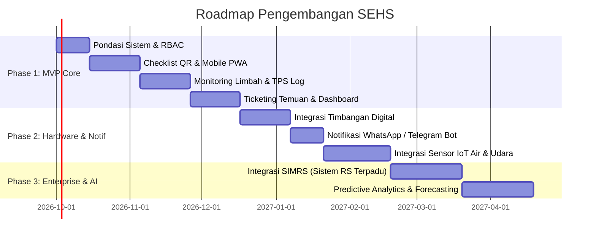

# Master Product Requirements Document (PRD)
# Smart Environment Health System (SEHS)

---

## 1. Metadata Dokumen

| Properti | Keterangan |
| :--- | :--- |
| **Nama Produk** | Smart Environment Health System (SEHS) |
| **Domain Spesifik** | Kesehatan Lingkungan Fasilitas Pelayanan Kesehatan (Rumah Sakit / Klinik) |
| **Tingkat Dokumen** | **Master PRD (Global System Overview)** |
| **Versi Dokumen** | 1.0.0 |
| **Status** | Approved / Baseline |
| **Terakhir Diperbarui** | 2026-09-14 |
| **Target Pembaca** | Product Manager, UI/UX Designer, Lead Engineer, QA Engineer, Stakeholder Manajemen Faskes |

---

## 2. Latar Belakang & Problem Statement

### 2.1 Konteks Masalah
Pada fasilitas pelayanan kesehatan (Rumah Sakit/Klinik), pengelolaan kesehatan lingkungan dan sanitasi merupakan faktor krusial untuk mencegah **Healthcare-Associated Infections (HAIs) / Infeksi Nosokomial**, menjamin kepatuhan terhadap regulasi pemerintah (misalnya regulasi sanitasi faskes Kemenkes), serta memenuhi standar akreditasi rumah sakit.

Namun di lapangan, mayoritas operasional masih menghadapi kendala klasik:
1. **Audit Kebersihan Berbasis Kertas:** Lembar checklist manual yang ditempel di pintu ruangan rentan dipalsukan (*tanda tangan borongan tanpa inspeksi riil*), rusak, dan tidak menyediakan data analitik seketika.
2. **Pengelolaan Limbah Medis B3 Kurang Transparan:** Pencatatan timbulan limbah (infeksius, tajam, sitotoksik, B3 kimiawi) sering kali tidak sinkron antara ruangan, Tempat Penampungan Sementara (TPS), dan pihak ketiga pengangkut limbah (*transporter* berizin), sehingga menimbulkan risiko kepatuhan hukum dan insiden keselamatan.
3. **Kapasitas TPS yang Tidak Terpantau Dinamis:** Kerap terjadi penumpukan limbah di TPS melebihi batas waktu simpan maksimal (misal > 48 jam pada suhu ruang untuk limbah infeksius) tanpa peringatan otomatis.
4. **Respon Lambat terhadap Kerusakan Fasilitas:** Temuan fasilitas kotor, wastafel tersumbat, atau exhaust fan rusak sering kali tidak terdokumentasi rapi, sehingga penanganannya lambat dan tidak memiliki pelacakan SLA (Service Level Agreement).
5. **Data Kualitas Lingkungan Tersebar:** Parameter kualitas air bersih dan kualitas udara ruangan jarang terpantau dalam satu dashboard terpusat yang mudah dievaluasi oleh manajemen.

### 2.2 Visi & Solusi Produk
**Smart Environment Health System (SEHS)** hadir sebagai platform digital terpadu yang menghubungkan petugas lapangan, pengawas sanitasi (sanitarian), tim teknis (IPSRS), dan direksi rumah sakit. 

Platform ini menghadirkan:
* **Verifikasi Kehadiran & Validasi Ruangan via QR Code:** Memastikan petugas benar-benar hadir secara fisik di ruangan saat melakukan inspeksi.
* **Traceability Limbah End-to-End:** Pencatatan transparan timbulan limbah dari sumber ruangan, transit di TPS, hingga penyerahan ke transporter eksternal.
* **Sistem Tiket Temuan Terintegrasi:** Mengubah insiden ketidaksesuaian kebersihan/fasilitas menjadi tiket perbaikan dengan penanggung jawab dan status penyelesaian yang terpantau jelas.
* **Pusat Analitik & Kepatuhan Real-Time:** Dashboard visual interaktif untuk memonitor KPI kepatuhan harian, neraca limbah, dan kesiapan dokumen akreditasi.

---

## 3. Matriks Peran Pengguna (Role-Based Access Control / RBAC)

Sistem ini melayani 4 persona utama dengan hak akses yang terisolasi:

### Tabel Rincian Hak Akses:
| Fitur / Modul | Petugas Lapangan (CS/Porter) | Sanitarian (Auditor) | Tim Teknis (IPSRS) | Manajemen / Direksi |
| :--- | :---: | :---: | :---: | :---: |
| **Scan QR & Isi Form Kebersihan** | Create, View (Ruangan Terkait) | View, Verify, Audit | No Access | View (Read-only) |
| **Log Limbah & Kapasitas TPS** | Create, View (Log Hari Ini) | Full Access, Validasi Manifes | No Access | View (Grafik & Neraca) |
| **Input Kualitas Air & Udara** | No Access | Full Access (Input & Monitor) | View (Terkait Sarana) | View (Ringkasan KPI) |
| **Pelaporan Temuan (Insiden)** | Create, View (Tiket Sendiri) | Create, Assign, Verify & Close | View Assigned, Update Progress | View All |
| **Master Data (Ruangan, QR, Akun)**| No Access | Manage Ruangan & Parameter | No Access | View All |
| **Executive Dashboard & Rekap Laporan**| Ringkasan Personal (Target Harian) | Full Dashboard & Export | Dashboard Tugas Tim | Full Executive Summary & Export |

---

## 4. Gambaran 5 Modul Utama Produk

Berikut adalah ringkasan fungsional dari 5 pilar utama SEHS:

### 4.1 Modul 1: Checklist Kebersihan Berbasis QR Code
* **Tujuan:** Menghilangkan form kertas dan menjamin verifikasi fisik petugas di ruangan yang diperiksa.
* **Fitur Kunci:**
  * Generator kode QR unik per ruangan/zona (dilengkapi kode enkripsi lokasi untuk mencegah duplikasi foto QR).
  * Form checklist dinamis menyesuaikan kategori ruangan (misal: Ruang Operasi memiliki checklist lebih ketat dibanding Ruang Administrasi).
  * Parameter inspeksi standar: kebersihan lantai, dinding, wastafel, tempat tidur pasien, kelengkapan sabun cuci tangan/handrub, tempat sampah medis/non-medis.
  * Pencatatan otomatis *timestamp*, identitas petugas, dan durasi inspeksi.
* *Spesifikasi rinci tersedia di:* [`features/01-prd-checklist-kebersihan-qr.md`](./features/01-prd-checklist-kebersihan-qr.md)

### 4.2 Modul 2: Monitoring & Pengelolaan Limbah (Waste Tracking)
* **Tujuan:** Pelacakan transparan timbulan limbah dari ruangan hingga penyerahan ke pihak ketiga sesuai standar lingkungan hidup.
* **Fitur Kunci:**
  * Kategorisasi limbah: **Infeksius/Medis**, **B3 Kimia/Farmasi**, **Benda Tajam (Safety Box)**, **Domestik/Organik**, dan **Daur Ulang/Anorganik**.
  * Pencatatan berat (Kg) dan volume per kantong/kontainer saat diambil dari unit penghasil.
  * Monitoring kapasitas terpakai di TPS (Tempat Penampungan Sementara) dalam bentuk persentase visual (% kuota kapasitas aman).
  * Sistem peringatan dini masa simpan limbah B3 (alert sebelum melampaui batas $2 \times 24$ jam pada suhu kamar).
  * Log manifes serah terima pengangkutan ke vendor berizin (*transporter log*).
* *Spesifikasi rinci tersedia di:* [`features/02-prd-monitoring-limbah.md`](./features/02-prd-monitoring-limbah.md)

### 4.3 Modul 3: Sanitasi & Kualitas Lingkungan Fisik
* **Tujuan:** Memastikan kondisi lingkungan pendukung faskes memenuhi baku mutu baku kesehatan lingkungan.
* **Fitur Kunci:**
  * **Monitoring Kualitas Air Bersih & Minum:** Parameter berkala (pH, Total Dissolved Solids / TDS, Kekeruhan, Sisa Klorin, dan catatan uji mikrobiologi E. coli).
  * **Monitoring Kualitas Udara Ruangan:** Parameter fisik ($PM_{2.5}$, $PM_{10}$, Suhu ruangan, Kelembaban relatif/RH, serta laju sirkulasi udara/ACH di ruang isolasi/operasi).
  * Mode input ganda: Input manual hasil pengukuran sanitarian atau penerimaan data otomatis melalui sensor IoT.
  * Status ambang batas visual: **Hijau (Aman/Sesuai Baku Mutu)**, **Kuning (Waspada)**, **Merah (Melampaui Ambang Batas)**.
* *Spesifikasi rinci tersedia di:* [`features/03-prd-sanitasi-kualitas-lingkungan.md`](./features/03-prd-sanitasi-kualitas-lingkungan.md)

### 4.4 Modul 4: Temuan & Alur Tindak Lanjut (Ticketing / CAPA)
* **Tujuan:** Jembatan penanganan insiden kebersihan atau kerusakan fasilitas secara cepat dan akuntabel.
* **Fitur Kunci:**
  * Pelaporan instan saat checklist kebersihan gagal atau ditemukan anomali di ruangan (misal: plafon bocor, kran rusak, tumpahan cairan tubuh).
  * Lampiran bukti foto sebelum (*Before*) dan deskripsi masalah.
  * Penugasan otomatis/manual ke tim terkait (Cleaning Service atau Teknisi IPSRS).
  * Siklus hidup tiket yang jelas: `Open` $\rightarrow$ `In Progress` $\rightarrow$ `Resolved (Disertai Foto After)` $\rightarrow$ `Closed / Verified (Disetujui Sanitarian)`.
  * Pelacakan Service Level Agreement (SLA) berdasarkan tingkat keparahan insiden (*Low*, *Medium*, *High/Critical*).
* *Spesifikasi rinci tersedia di:* [`features/04-prd-temuan-tindak-lanjut.md`](./features/04-prd-temuan-tindak-lanjut.md)

### 4.5 Modul 5: Jadwal Kegiatan & Dashboard Eksekutif
* **Tujuan:** Memberikan kendali penuh kepada manajemen atas performa sanitasi seluruh faskes secara *real-time*.
* **Fitur Kunci:**
  * Kalender jadwal kegiatan sanitasi (jadwal fogging, pembersihan tandon air, jadwal angkut limbah B3 oleh vendor, audit internal).
  * *Executive KPI Cards:* Persentase kepatuhan checklist harian (% Compliance), Total timbulan limbah harian/bulanan, Jumlah tiket temuan aktif vs terselesaikan.
  * Grafik tren historis kualitas lingkungan dan kepatuhan per gedung/lantai.
  * Generator laporan otomatis (Export format PDF & Excel) yang disesuaikan dengan format pelaporan akreditasi faskes dan dinas lingkungan hidup.
* *Spesifikasi rinci tersedia di:* [`features/05-prd-dashboard-laporan.md`](./features/05-prd-dashboard-laporan.md)

---

## 5. Alur Penggunaan End-to-End (Core User Journey)

### Alur Kerja Inspeksi Ruangan & Eskalasi Temuan:

---

## 6. Arsitektur & Lingkup Platform

Sistem SEHS dibangun dengan pemisahan antarmuka yang disesuaikan dengan karakteristik pengguna:

1. **Mobile-First Web / Progressive Web App (PWA):**
   * Ditujukan untuk: Petugas Cleaning Service, Porter Pengangkut Limbah, Teknisi Lapangan.
   * Kebutuhan utama: Responsif pada layar smartphone, akses cepat ke modul kamera hardware untuk pemindaian QR code & upload foto bukti, konsumsi data ringan.
2. **Desktop Web Admin & Dashboard:**
   * Ditujukan untuk: Sanitarian, Kepala Instalasi Kesling, Tim IPSRS, dan Jajaran Direksi/Manajemen.
   * Kebutuhan utama: Tampilan visual layar lebar, tabel data lengkap dengan multi-filter (berdasarkan tanggal, ruangan, kategori limbah), grafik interaktif, cetak label/QR, dan ekspor laporan.

---

## 7. Kebutuhan Non-Fungsional (Non-Functional Requirements / NFR)

### 7.1 Ketersediaan & Toleransi Jaringan (Offline-Resilience)
* Mengingat beberapa area rumah sakit (seperti ruang bawah tanah/basement, ruang radiologi, atau TPS belakang) memiliki sinyal internet yang lemah:
  * Aplikasi mobile harus dilengkapi *client-side caching* (Local Storage / IndexedDB).
  * Petugas dapat mengisi checklist meskipun koneksi terputus sesaat; data akan otomatis tersinkronisasi (*background sync*) begitu perangkat mendeteksi koneksi stabil kembali.

### 7.2 Integritas Data & Jejak Audit (Audit Trail)
* Seluruh pencatatan checklist dan log limbah bersifat **immutable** (tidak dapat dihapus sembarangan).
* Setiap perubahan data harus mencatat: `user_id`, `timestamp_utc`, `ip_address`, dan status lama vs status baru untuk kebutuhan audit akreditasi.

### 7.3 Kinerja Sistem (Performance)
* Pemindaian QR code hingga form siap diisi harus terjadi dalam waktu $< 1.5$ detik pada jaringan seluler standar (4G).
* Dashboard analitik manajemen harus mampu memuat rekap data bulanan dalam waktu $< 2.0$ detik.

### 7.4 Keamanan Informasi
* Implementasi otentikasi berbasis Token (JWT / Secure Session) dengan enkripsi TLS/HTTPS pada seluruh jalur komunikasi data.
* *Role-Based Authorization* yang ketat di tingkat API endpoint untuk mencegah akses data lintas wewenang.

---

## 8. Metrik Keberhasilan Produk (Success Metrics / KPIs)

| Kategori Metrik | Indikator Kinerja Utama (KPI) | Target Keberhasilan |
| :--- | :--- | :---: |
| **Kepatuhan Audit** | Persentase ruangan yang selesai diaudit kebersihannya tepat waktu harian | $\ge 95\%$ |
| **Kecepatan Tindak Lanjut** | Rata-rata waktu penyelesaian (*Mean Time to Resolve - MTTR*) temuan kategori High | $< 4\text{ jam}$ |
| **Akurasi Neraca Limbah** | Selisih berat limbah tercatat di unit asal vs berat limbah masuk di TPS | $\le 2\%$ variansi timbangan |
| **Kepatuhan Penyimpanan TPS** | Insiden limbah B3 tersimpan di TPS melampaui batas regulasi ($> 48$ jam tanpa pendingin) | **0 Insiden (Nol Pelanggaran)** |
| **Eliminasi Kertas** | Pengurangan konsumsi lembar kertas checklist fisik di seluruh fasilitas | $100\%$ digital |

---

## 9. Rencana Pengembangan Bertahap (Roadmap & Phasing)

* **Fase 1 (MVP — Minimum Viable Product):** Digitalisasi penuh form checklist QR, pencatatan limbah manual terverifikasi, sistem tiket temuan, dan dashboard kepatuhan.
* **Fase 2 (Smart Hardware & Notification):** Integrasi timbangan digital via Bluetooth/Serial, webhook notifikasi instan (WhatsApp/Telegram) untuk alert temuan darurat, serta koneksi sensor IoT air dan udara langsung ke cloud server.
* **Fase 3 (Enterprise & AI Integration):** Integrasi dua arah dengan Sistem Informasi Manajemen Rumah Sakit (SIMRS) serta analitik prediktif untuk estimasi beban limbah dan pemeliharaan sarana preventif.

---

## 10. Indeks Rincian Feature PRD

Untuk spesifikasi teknis dan fungsional detail setiap modul, silakan merujuk pada dokumen masing-masing:
1. 📄 [Feature PRD 01: Checklist Kebersihan & QR Code](./features/01-prd-checklist-kebersihan-qr.md)
2. 📄 [Feature PRD 02: Monitoring Limbah & Kapasitas TPS](./features/02-prd-monitoring-limbah.md)
3. 📄 [Feature PRD 03: Sanitasi & Kualitas Lingkungan Fisik](./features/03-prd-sanitasi-kualitas-lingkungan.md)
4. 📄 [Feature PRD 04: Temuan & Alur Tindak Lanjut](./features/04-prd-temuan-tindak-lanjut.md)
5. 📄 [Feature PRD 05: Executive Dashboard & Laporan Kepatuhan](./features/05-prd-dashboard-laporan.md)
