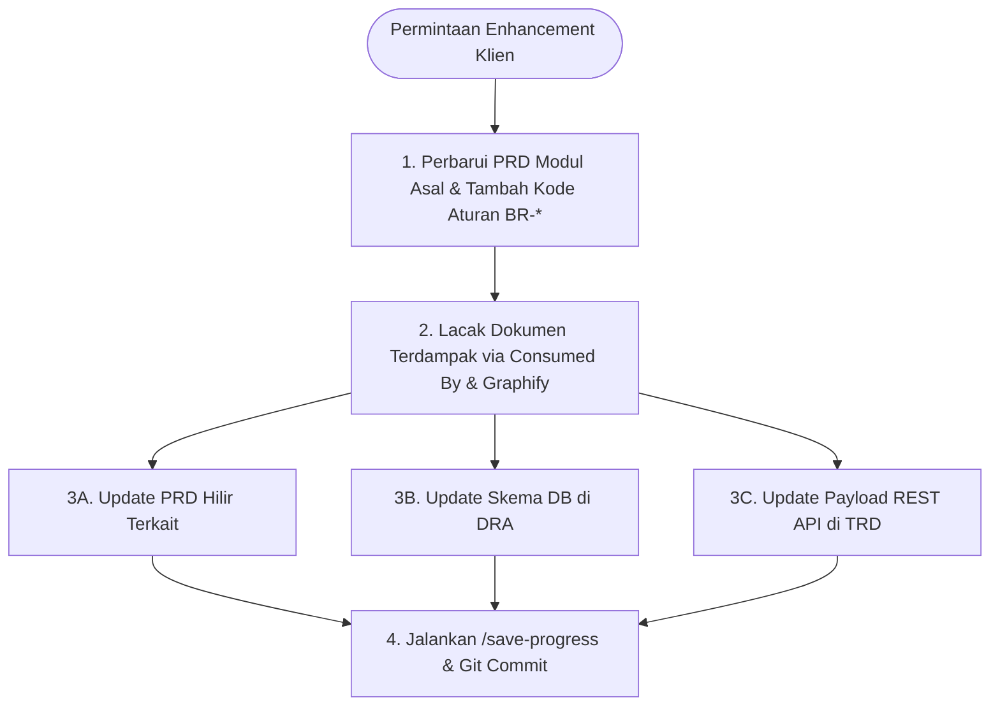

# Smart Environment Health System (SEHS) — Documentation Hub

Selamat datang di repositori dokumentasi resmi sistem **Smart Environment Health System (SEHS)**. Sistem ini dirancang untuk mendigitalisasi, memantau, dan mengelola operasional kesehatan lingkungan dan sanitasi secara terintegrasi dan *real-time*, khususnya pada fasilitas pelayanan kesehatan (Rumah Sakit, Klinik, dan Laboratorium).

---

## 📌 Navigasi Dokumentasi

Dokumentasi ini disusun menggunakan pendekatan **Modular Product Documentation (Master PRD & Feature PRDs)** agar mudah dipahami oleh manajemen, product manager, UI/UX designer, software engineer, dan tim QA.

```text
sehs-docs/
├── README.md                                  # Halaman panduan utama (Anda berada di sini)
├── 00-MASTER-PRD.md                           # Dokumen Induk (Global Product Requirement Document)
├── PROGRESS.md                                # Status pengerjaan, checkpoint sesi & roadmap harian
├── FEATURE-CHECKLIST.md                       # Master Checklist Fitur & Implementasi Teknis (BE & FE)
│
├── .github/
│   └── ISSUE_TEMPLATE/                       # Template Tiket Tugas GitHub Issues
│       ├── backend-task.md                   # Tugas Backend (Database & REST API)
│       ├── frontend-web-task.md              # Tugas Frontend Web Dashboard (Admin/Sanitarian)
│       └── frontend-mobile-task.md           # Tugas Frontend Mobile App (Flutter Lapangan)
│
└── features/                                  # Rincian spesifikasi detail per modul (Feature PRD)
    ├── 01-prd-auth-user.md                    # Fondasi Identitas: Autentikasi NIK+PIN / Web Login
    │
    ├── master-data/                           # FONDASI DATA INDUK FASILITAS (PER KLASTER)
    │   ├── 01-md-organisasi-shift.md          # Klaster 1: Unit Departemen & Jam Shift Kerja
    │   ├── 02-md-fasilitas-ruangan-qr.md      # Klaster 2: Gedung, Ruangan & Cetak Stiker QR
    │   ├── 03-md-standar-checklist.md         # Klaster 3: Pustaka Indikator & Template Audit
    │   ├── 04-md-limbah-tps-vendor.md         # Klaster 4: Kategori Limbah B3, Kuota TPS & Vendor
    │   ├── 05-md-baku-mutu-air-udara.md       # Klaster 5: Standar Baku Mutu Permenkes Air & Udara
    │   └── 06-md-kategori-temuan-sla.md       # Klaster 6: Kategori Insiden & Batas Waktu SLA
    │
    └── operational/                           # TRANSAKSI OPERASIONAL HARIAN
        ├── 01-prd-checklist-kebersihan-qr.md  # Modul 1: Checklist Ruangan & Validasi QR Code
        ├── 02-prd-monitoring-limbah.md        # Modul 2: Pelacakan Limbah B3, Domestik & TPS
        ├── 03-prd-sanitasi-kualitas-lingkungan.md # Modul 3: Pemantauan Kualitas Air & Udara
        ├── 04-prd-temuan-tindak-lanjut.md     # Modul 4: Pelaporan Insiden & Tiket Perbaikan
        └── 05-prd-dashboard-laporan.md        # Modul 5: Executive Dashboard & Laporan Kepatuhan
│
└── technical/                                 # SPESIFIKASI TEKNIS & ARSITEKTUR (DRA & TRD)
    ├── 01-dra-database-erd-master-auth.md     # Skema Database PostgreSQL 15+, Relasi FK & Mermaid ERD
    ├── 02-trd-auth-session-api.md             # Kontrak REST API Autentikasi NIK+PIN, Web Login & Sesi
    ├── 03-trd-master-data-api.md              # Kontrak REST API Master Data Fasilitas & Standar
    └── 04-trd-security-qr-offline.md          # Keamanan Token QR Anti-Kloning & Offline Flutter/PWA Sync
```

---

## 🚀 Ringkasan Modul & Klaster PRD

### A. Fondasi Identitas & Akses
* 📄 [`features/01-prd-auth-user.md`](./features/01-prd-auth-user.md) — Dual-UX login (Mobile NIK+PIN untuk petugas lapangan & Web Email+Password untuk kantor/direksi), sesi shift 8 jam stabil.

### B. Fondasi Data Induk (Master Data Clusters)
* 🏢 [`features/master-data/01-md-organisasi-shift.md`](./features/master-data/01-md-organisasi-shift.md) — Pengelolaan unit faskes, shift kerja Pagi/Siang/Malam, dan aturan handover.
* 📍 [`features/master-data/02-md-fasilitas-ruangan-qr.md`](./features/master-data/02-md-fasilitas-ruangan-qr.md) — Hierarki gedung, inventaris ruangan, zonasi risiko infeksi, dan generator PDF stiker QR code siap cetak.
* 📋 [`features/master-data/03-md-standar-checklist.md`](./features/master-data/03-md-standar-checklist.md) — Pustaka indikator kebersihan, perakitan template form per tipe ruangan, bobot nilai, dan passing grade kelulusan.
* ☣️ [`features/master-data/04-md-limbah-tps-vendor.md`](./features/master-data/04-md-limbah-tps-vendor.md) — Kategori limbah B3 medis/domestik, kuota TPS, ambang waktu simpan maks 48 jam, dan legalitas vendor transporter KLHK.
* 💧 [`features/master-data/05-md-baku-mutu-air-udara.md`](./features/master-data/05-md-baku-mutu-air-udara.md) — Standar baku mutu Permenkes untuk air (pH, TDS, E.coli) dan udara ruangan (suhu, RH, ACH), serta titik uji sampling.
* ⚠️ [`features/master-data/06-md-kategori-temuan-sla.md`](./features/master-data/06-md-kategori-temuan-sla.md) — Klasifikasi masalah fasilitas, disposisi tim (Cleaning vs IPSRS), dan jam hitung mundur SLA penyelesaian tiket.

### C. Modul Transaksi Operasional & Analitik
* 📱 [`features/operational/01-prd-checklist-kebersihan-qr.md`](./features/operational/01-prd-checklist-kebersihan-qr.md) — Validasi fisik kehadiran via scan QR pintu, form inspeksi dinamis, dan kalkulasi kepatuhan.
* ⚖️ [`features/operational/02-prd-monitoring-limbah.md`](./features/operational/02-prd-monitoring-limbah.md) — Log timbangan limbah ruangan, kapasitas TPS real-time, dan manifes serah terima vendor.
* 🧪 [`features/operational/03-prd-sanitasi-kualitas-lingkungan.md`](./features/operational/03-prd-sanitasi-kualitas-lingkungan.md) — Form uji lab berkala & penerimaan data sensor fisik lingkungan.
* 🛠️ [`features/operational/04-prd-temuan-tindak-lanjut.md`](./features/operational/04-prd-temuan-tindak-lanjut.md) — Alur pelaporan kerusakan sarana, upload foto Before/After, pelacakan SLA, dan approval Sanitarian.
* 📊 [`features/operational/05-prd-dashboard-laporan.md`](./features/operational/05-prd-dashboard-laporan.md) — Visualisasi analitik eksekutif, rekap kepatuhan faskes, neraca limbah B3, dan ekspor laporan akreditasi.

### D. Spesifikasi Arsitektur Teknis (DRA & TRD)
* 🗄️ [`technical/01-dra-database-erd-master-auth.md`](./technical/01-dra-database-erd-master-auth.md) — [DRA] Skema relasional PostgreSQL 15+ (11 enum, 17 tabel, audit trail universal, soft delete, indexes, dan Mermaid ERD).
* 🔐 [`technical/02-trd-auth-session-api.md`](./technical/02-trd-auth-session-api.md) — [TRD] REST API Autentikasi NIK+PIN mobile, Web login, Argon2id, JWT RS256, Refresh Token Rotation, dan mitigasi brute-force.
* 🌐 [`technical/03-trd-master-data-api.md`](./technical/03-trd-master-data-api.md) — [TRD] REST API CRUD untuk 6 klaster Master Data (Unit, Shift, Ruangan, QR Generator, Checklist, Limbah, Standar Mutu, SLA).
* 🛡️ [`technical/04-trd-security-qr-offline.md`](./technical/04-trd-security-qr-offline.md) — [TRD] Kriptografi token QR (HMAC-SHA256), validasi geofencing anti-kloning, dan arsitektur Offline-First (Flutter SQLite/Hive & PWA Outbox Queue).

---

## 👥 Matriks Peran Pengguna (Roles)

1. **Petugas Lapangan (Cleaning Service / Waste Porter):** Antarmuka **Mobile App (Flutter)** untuk scan QR ruangan instan via kamera, isi form checklist, input timbangan limbah, dan simpan offline di area tanpa sinyal.
2. **Sanitarian / Auditor Lingkungan:** Antarmuka **Web Admin Dashboard** untuk verifikasi hasil audit, input uji lab kualitas air/udara, pengawasan kepatuhan, dan approval tiket temuan.
3. **Tim Pemeliharaan Sarana / IPSRS:** Antarmuka **Web Dashboard & Mobile** untuk menerima disposisi tiket perbaikan sarana ruangan dan memperbarui status progres pengerjaan.
4. **Manajemen / Direksi Faskes:** Antarmuka **Web Dashboard** untuk memantau ringkasan kepatuhan fasilitas, status TPS, serta mengunduh dokumen laporan berkala.

---

## 🧠 Second Brain & Knowledge Graph (Graphify)

Repositori ini telah terintegrasi dengan **Graphify** sebagai *Second Brain* dan *Knowledge Graph* persisten. Graphify memetakan seluruh modul, peran pengguna, alur proses, dan konsep arsitektur ke dalam graf relasi (*Nodes & Edges*), sehingga AI assistant dan tim developer dapat menavigasi struktur sistem tanpa kehilangan konteks.

### 1. Membuka Visualisasi Graf Interaktif
Visualisasi graf interaktif tersedia di [`graphify-out/graph.html`](./graphify-out/graph.html). Anda dapat membukanya langsung di browser tanpa perlu menjalankan web server:

* **Di macOS (Terminal):**
  ```bash
  open graphify-out/graph.html
  ```
* **Fitur Visualizer:**
  * **Search & Inspect:** Cari entitas (misal: `Checklist`, `Limbah B3`, `IPSRS`) di kolom pencarian sebelah kanan untuk melihat tetangga relasinya (*connected neighbors*).
  * **Color Clusters:** Node dikelompokkan otomatis berdasarkan komunitas pengetahuan (*Sanitasi*, *Inspeksi Lapangan*, *Dashboard Eksekutif*, dll.).
  * **Interactive Physics:** Node dapat digeser, diperbesar (*zoom in/out*), dan difilter per komunitas.

### 2. Berinteraksi & Query Graf dengan AI
Anda dapat memanfaatkan graf pengetahuan ini langsung di terminal atau melalui prompt asisten AI:

* **Mencari Jawaban Terkait Relasi Arsitektur:**
  ```bash
  graphify query "Bagaimana alur checklist QR terhubung dengan sistem tiket temuan IPSRS?"
  ```
* **Melihat Jalur Hubungan Terpendek Antar-Konsep:**
  ```bash
  graphify path "00_master_prd_modul_checklist_qr" "00_master_prd_kpi_mttr"
  ```
* **Melihat Penjelasan Detail Suatu Node:**
  ```bash
  graphify explain "00_master_prd_tps_limbah"
  ```

### 3. Memperbarui Graf Setelah Menambah/Mengubah Dokumen
Setiap kali Anda membuat atau memperbarui file Feature PRD di folder `features/`, perbarui graf pengetahuan dengan perintah:

```bash
# Update inkremental (hanya memproses dokumen baru/berubah)
graphify update .

# Atau generate ulang secara penuh
graphify extract .
graphify export html
```

### 4. File Output Graphify (`graphify-out/`)
* **[`graphify-out/graph.html`](./graphify-out/graph.html):** Visual graf interaktif untuk browser.
* **[`graphify-out/GRAPH_REPORT.md`](./graphify-out/GRAPH_REPORT.md):** Laporan analisis jaringan, *God Nodes*, kohesi komunitas, dan pertanyaan arsitektur kunci.
* **[`graphify-out/graph.json`](./graphify-out/graph.json):** Data mentah graf untuk kebutuhan konsumsi AI dan GraphRAG.

---

## 📖 Panduan Kontribusi & Manajemen Perubahan (Change Management)

### 1. Prinsip Utama: *Zero Documentation Drift*
Dalam ekosistem dokumentasi multi-tier SEHS (**Master PRD $\rightarrow$ Feature PRD $\rightarrow$ DRA Database $\rightarrow$ TRD API Contracts**):
- **Tidak ada dokumen yang berdiri sendiri (*No isolated island*).**
- Setiap perubahan aturan bisnis di tingkat PRD **wajib diselaraskan secara kaskade (*cascade update*)** ke dokumen hilir yang mengonsumsinya serta spesifikasi teknis di folder `technical/`.
- Prosedur tata kelola lengkap diatur dalam skill: [`.agents/skills/change-impact-synchronizer/SKILL.md`](./.agents/skills/change-impact-synchronizer/SKILL.md).

---

### 2. Alur 4 Langkah Menangani Request Enhancement dari Klien

Jika klien faskes atau manajemen mengajukan perubahan aturan, alur kerja baru, atau penambahan fitur (*enhancement*):



1. **Langkah 1: Perbarui Dokumen Asal (Hulu)**
   * Buka PRD modul terkait di `features/`.
   * Tambahkan klausul aturan bisnis baru dengan ID unik (misal: `BR-MD04-06`, `BR-OP01-12`).
   * Naikkan nomor versi dokumen (misal: `v1.0.0` $\rightarrow$ `v1.1.0`).
2. **Langkah 2: Lacak Dokumen yang Terdampak (*Impact Analysis*)**
   * Periksa baris metadata `Consumed By (Dampak)` di bagian atas PRD asal.
   * Gunakan AI & Graphify untuk menemukan dependensi tersembunyi:
     ```bash
     graphify query "Apa saja alur, tabel DB, dan API yang terdampak oleh perubahan pada [Nama Fitur]?"
     ```
3. **Langkah 3: Eksekusi *Cascade Update* ke Dokumen Terkait**
   * **Di PRD Hilir:** Sesuaikan alur pengguna dan validasi input.
   * **Di DRA (`technical/01-dra-*.md`):** Tambahkan kolom baru, tipe data, foreign key, atau enum di tabel database dengan komentar referensi aturan bisnis (`-- Implements BR-XX-YY`).
   * **Di TRD (`technical/02-trd-*.md` s/d `04-trd-*.md`):** Tambahkan field pada request/response DTO JSON dan kode error baru.
4. **Langkah 4: Simpan Progres & Sinkronkan Knowledge Graph**
   * Jalankan perintah `/save-progress` untuk memperbarui [`PROGRESS.md`](./PROGRESS.md), menyinkronkan graf Graphify, dan membuat commit git.

---

### 3. Contoh Prompt Cepat untuk Menjalankan Enhancement dengan AI

Anda tidak perlu melakukan penelusuran manual satu per satu. Anda cukup memberikan perintah terarah kepada asisten AI:

> *"Bro, ada request enhancement dari klien: [Sebutkan permintaan fitur/aturan baru]. Tolong lakukan cascade update mulai dari PRD modul asal, dokumen hilir terkait, skema DRA database, hingga kontrak endpoint TRD API."*

Asisten AI akan secara otomatis:
1. Memicu skill `change-impact-synchronizer`.
2. Melacak seluruh rantai dependensi dari hulu ke hilir.
3. Melakukan editing berkas secara presisi tanpa merusak aturan arsitektur lainnya.
4. Menampilkan laporan daftar berkas yang telah diselaraskan.

---

### 4. Titik Simpan Sesi Kerja (*Session Checkpoint*)
* **Jalankan Slash Command:** Setiap kali selesai bekerja atau sebelum menutup IDE, ketik `/save-progress` atau perintahkan *"save progress bro"*.
* **Status Progres Proyek:** Pantau status penyelesaian seluruh modul dan rencana kerja di [`PROGRESS.md`](./PROGRESS.md).

---

## 🎫 Panduan Penerbitan & Pembaruan Tiket Tugas (GitHub Issues untuk BE, FE-WEB & FE-MOBILE)

Repositori ini mendukung metodologi **Spec-Driven Development / Issue-Driven Development (IDD)**. Seluruh dokumen spesifikasi (PRD, DRA, dan TRD) dapat langsung diterbitkan menjadi tiket **GitHub Issues** yang terstruktur bagi tim Backend, Frontend Web, dan Frontend Mobile, serta dapat diperbarui kapan saja saat terjadi perubahan lingkup pengerjaan.

### 1. Tiga Kategori Tiket Resmi

| Label | Kategori Tugas | Platform & Tech Stack | Dokumen Rujukan Utama | Template Issue |
| :--- | :--- | :--- | :--- | :--- |
| `backend` | **`[BE]` Backend** | NestJS / Go / Laravel + PostgreSQL | • Skema Database [`technical/01-dra-*.md`](./technical/01-dra-database-erd-master-auth.md)<br>• Kontrak API [`technical/02-trd-*.md`](./technical/02-trd-auth-session-api.md) | [`.github/ISSUE_TEMPLATE/backend-task.md`](./.github/ISSUE_TEMPLATE/backend-task.md) |
| `frontend-web` | **`[FE-WEB]` Web Admin** | React / Vue / Next.js (Desktop) | • PRD Form & Validasi [`features/master-data/*`](./features/master-data/)<br>• Master Data API [`technical/03-trd-*.md`](./technical/03-trd-master-data-api.md) | [`.github/ISSUE_TEMPLATE/frontend-web-task.md`](./.github/ISSUE_TEMPLATE/frontend-web-task.md) |
| `frontend-mobile` | **`[FE-MOBILE]` Mobile App** | **Flutter (Dart)** (Android & iOS) | • Alur Petugas Lapangan [`features/01-prd-auth-user.md`](./features/01-prd-auth-user.md)<br>• QR & Offline Spec [`technical/04-trd-*.md`](./technical/04-trd-security-qr-offline.md) | [`.github/ISSUE_TEMPLATE/frontend-mobile-task.md`](./.github/ISSUE_TEMPLATE/frontend-mobile-task.md) |

---

### 2. Cara Menerbitkan Tiket via AI (Otomatis)

Gunakan slash command `/publish-issue` atau minta asisten AI:

> *"Bro, tolong terbitkan tiket GitHub Issues untuk modul [Nama Modul] bagi tim BE, FE-WEB, dan FE-MOBILE."*

Asisten AI akan secara otomatis:
1. Menjalankan skill [`.agents/skills/issue-task-scaffolder/SKILL.md`](./.agents/skills/issue-task-scaffolder/SKILL.md).
2. Mengekstrak aturan bisnis (`BR-*`), skema tabel, dan endpoint DTO.
3. Menerbitkan tiket langsung ke repositori GitHub via `gh issue create`.
4. Memberikan tautan issue yang berhasil dibuat (misal: `https://github.com/bagusyanuar/sehs-docs/issues/1`).

---

### 3. Cara Menerbitkan Tiket via GitHub CLI (`gh`) Secara Manual

```bash
# 1. Tiket Backend
gh issue create \
  --title "[BE] Auth API: Implementasi Dual-UX Login & Manajemen Sesi" \
  --label "backend,auth" \
  --body-file ".github/ISSUE_TEMPLATE/backend-task.md"

# 2. Tiket Frontend Web Admin
gh issue create \
  --title "[FE-WEB] Master Data: Bangun Antarmuka Manajemen Gedung & Ruangan" \
  --label "frontend-web,master-data" \
  --body-file ".github/ISSUE_TEMPLATE/frontend-web-task.md"

# 3. Tiket Frontend Mobile Flutter
gh issue create \
  --title "[FE-MOBILE] Auth: Numeric Keypad NIK+PIN & SQLite Local Storage" \
  --label "frontend-mobile,auth" \
  --body-file ".github/ISSUE_TEMPLATE/frontend-mobile-task.md"
```

---

### 4. Cara Meng-update atau Menambah Lingkup pada Tiket yang Sudah Ada

Jika Anda menemukan ada kebutuhan yang kurang atau ada aturan baru yang ingin disisipkan ke tiket yang sudah terbit:

#### A. Melalui Perintah Asisten AI (Paling Praktis)
Cukup ketik perintah di chat:
> *"Bro, tolong update Issue #1: tambahkan checklist pengujian brute-force Redis dan tambahkan label enhancement."*

Asisten AI akan otomatis membaca tiket lama, menyisipkan poin baru, dan mengeksekusi pembaruan via `gh issue edit`.

#### B. Melalui Terminal GitHub CLI (`gh`)
```bash
# Mengubah / memperbarui isi teks body issue
gh issue edit 1 --body "Isi teks baru lengkap..."

# Menambahkan label baru tanpa menghapus label lama
gh issue edit 1 --add-label "enhancement"

# Menambahkan komentar / catatan tambahan di bawah tiket
gh issue comment 1 --body "📌 Catatan: Pastikan seeder default user memuat role SANITARIAN dan FIELD_OFFICER."
```

#### C. Melalui Web Browser GitHub
1. Buka tautan tiket (misal: `https://github.com/bagusyanuar/sehs-docs/issues/1`).
2. Klik ikon menu titik tiga `...` di pojok kanan atas deskripsi issue $\rightarrow$ pilih **Edit**.
3. Sesuaikan teks yang diinginkan $\rightarrow$ klik tombol hijau **Update comment**.

---

### 5. Cara Mengonsumsi Tiket Saat Mulai Coding

Saat Anda atau developer membuka repositori implementasi kode:
* **Di Repo Backend:** Cukup beri prompt ke AI:  
  *"Tolong kerjakan GitHub Issue #1 (https://github.com/bagusyanuar/sehs-docs/issues/1). Buatkan migration tabel PostgreSQL dan REST API controller sesuai TRD."*
* **Di Repo Flutter Mobile:** Cukup beri prompt ke AI:  
  *"Tolong kerjakan GitHub Issue #3 (link issue). Buatkan UI keypad NIK+PIN dan integrasikan local storage via SQLite/Hive sesuai TRD-03."*

Dengan alur ini, tim koding langsung memiliki **konteks 100% presisi tanpa perlu membaca ulang seluruh dokumentasi dari nol**!

---

### 6. Otomatisasi Lintas Repositori (Cross-Repo Auto-Close via PR)

Ketika Anda membuat Pull Request (PR) atau commit di repositori kode implementasi (misal di repo `sehs-backend`, `sehs-web`, atau `sehs-mobile`), tiket issue di repositori dokumentasi ini bisa **tertutup secara otomatis (*auto-close*)** begitu PR di-merge ke branch `main`.

#### Cara Penulisan di Deskripsi PR atau Commit Repo Kode:
Gunakan sintaks path repositori lengkap:
```markdown
## Summary Pengerjaan
Implementasi endpoint autentikasi Dual-UX dan hashing Argon2id.

Closes bagusyanuar/sehs-docs#1
```
*(Kata kunci resmi yang didukung GitHub: `Closes`, `Fixes`, atau `Resolves`).*

#### Manfaat Otomatisasi Ini:
1. **Live Cross-Reference:** Begitu PR dibuat di repo backend/frontend, halaman issue di `sehs-docs` otomatis memunculkan tautan timeline yang terhubung ke PR tersebut.
2. **Auto-Close:** Saat PR di-merge ke `main`, GitHub seketika mengubah status Issue terkait di `sehs-docs` menjadi **`CLOSED (Completed)`** tanpa perlu ditutup manual.
3. **Multi-Repo Kanban:** Anda dapat menghubungkan repo `sehs-docs`, `sehs-backend`, `sehs-web`, dan `sehs-mobile` ke dalam satu papan **GitHub Projects (Kanban Board)** di akun `bagusyanuar` untuk memantau progres seluruh sistem dari satu layar.


