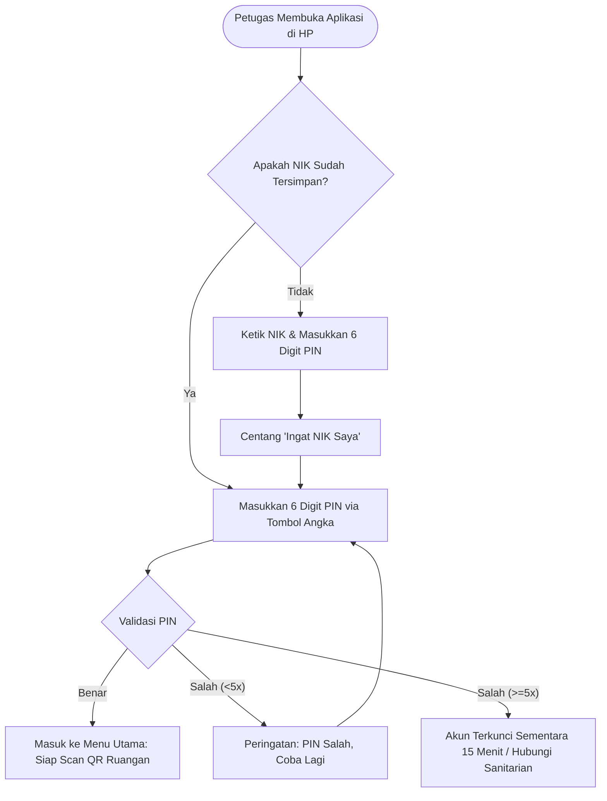

# Feature PRD: Autentikasi & Manajemen Pengguna (Auth & User)

---

## 1. Metadata Dokumen

| Properti | Keterangan |
| :--- | :--- |
| **Kode Dokumen** | `PRD-SEHS-01` |
| **Nama Modul** | Autentikasi & Manajemen Pengguna (*Identity & Access*) |
| **Dokumen Induk** | [`00-MASTER-PRD.md`](../00-MASTER-PRD.md) |
| **Depends On (Prasyarat)** | [`00-MASTER-PRD.md`](../00-MASTER-PRD.md) (Konsep Dasar Sistem & Matriks Peran Pengguna) |
| **Consumed By (Dampak)** | • **Klaster Master Data:** [`master-data/01-md-organisasi-shift.md`](./master-data/01-md-organisasi-shift.md) s/d [`06-md-kategori-temuan-sla.md`](./master-data/06-md-kategori-temuan-sla.md) (Akses Sanitarian untuk mengelola seluruh data induk fasilitas) • **Modul Operasional:** `operational/01-prd-checklist-kebersihan-qr.md` s/d `05-prd-dashboard-laporan.md` (Identitas & otentikasi seluruh aktor pelaksana transaksi lapangan & manajemen) |
| **Versi** | 2.2.0 (Business-Centric Edition) |
| **Status** | Approved / Baseline |
| **Terakhir Diperbarui** | 2026-09-14 |
| **Target Pembaca** | Klien, Manajemen Faskes, Product Manager, UI/UX Designer, QA Tester, Software Engineer |

---

## 2. Latar Belakang & Masalah Bisnis

### 2.1 Masalah Nyata di Fasilitas Kesehatan
Dalam operasional harian rumah sakit atau klinik, validitas data kebersihan dan pengelolaan limbah sangat bergantung pada **siapa yang bertanggung jawab di lapangan**. 

Kendala yang selama ini terjadi:
1. **Audit Form Kertas Rentan Manipulasi:** Petugas kebersihan sering menandatangani lembar checklist di akhir shift secara borongan tanpa inspeksi berkala riil.
2. **Ketiadaan Bukti Identitas yang Sah:** Saat terjadi insiden tumpahan limbah B3 medis atau komplain ruangan kotor dari pasien, manajemen kesulitan melacak petugas yang bertugas pada shift tersebut.
3. **Friksi Akses Petugas Lapangan:** Petugas kebersihan dan porter limbah umumnya bekerja dengan mobilitas tinggi dan menggunakan sarung tangan atau APD. Sistem login konvensional yang meminta email panjang dan kata sandi rumit terbukti memicu keengganan menggunakan aplikasi.
4. **Sesi Terputus di Tengah Jam Kerja:** Banyak sistem menutup sesi otomatis setelah beberapa menit tidak aktif, menyebabkan data checklist yang sedang diisi petugas di kamar pasien hilang dan harus diulang dari awal.

### 2.2 Nilai Bisnis & Manfaat Sistem
* **Akuntabilitas Mutlak (*Non-Repudiation*):** Setiap centang checklist dan log timbangan limbah otomatis terstempel atas nama petugas yang sah dan jam operasional yang presisi, memenuhi standar akreditasi rumah sakit.
* **Adopsi Pengguna Tinggi (*High User Adoption*):** Menyediakan mekanisme login cepat yang dirancang khusus untuk kenyamanan pekerja lapangan tanpa mengurangi faktor keamanan.
* **Kelancaran Operasional Shift:** Sesi kerja dirancang aktif stabil sepanjang jam giliran kerja (*shift*) sehingga tidak mengganggu mobilitas petugas.

---

## 3. Persona Pengguna & Konteks Operasional

| Persona | Profil & Lingkungan Kerja | Kebutuhan Utama Akses |
| :--- | :--- | :--- |
| **Petugas Lapangan** *(Cleaning Service & Porter Limbah)* | • Bekerja di bangsal rawat inap, lorong, dan area TPS. • Menggunakan smartphone/tablet (PWA Mobile). • Sering mengenakan sarung tangan/APD kerja. | • Login super cepat dan mudah diingat (tanpa ketik email/password panjang). • Tombol angka besar dan jelas. • Sesi kerja tidak mudah keluar sendiri. |
| **Sanitarian & Pengawas** *(Auditor Kesling)* | • Bekerja di ruang kantor kesling atau inspeksi keliling. • Menggunakan laptop/PC desktop dan smartphone. | • Keamanan kredensial standar perkantoran. • Wewenang mengelola data akun petugas dan membantu reset akses jika petugas lupa PIN. |
| **Teknisi Sarana** *(IPSRS)* | • Mobilitas antara bengkel kerja dan unit ruangan. • Menerima laporan kerusakan fasilitas. | • Login fleksibel untuk memantau tiket pekerjaan perbaikan sarana yang ditugaskan kepadanya. |
| **Manajemen & Direksi** | • Bekerja di ruang direksi / kantor pimpinan. • Menggunakan desktop atau tablet. | • Akses eksklusif untuk memantau ringkasan KPI eksekutif dan mengunduh laporan kepatuhan. |

---

## 4. Alur Pengalaman Pengguna (User Journey)

### 4.1 Alur Masuk Kerja Petugas Lapangan (Mobile PWA)

### 4.2 Alur Pergantian Shift Kerja (Shift Handover)
1. **Petugas Shift Pagi:** Menyelesaikan seluruh checklist ruangan dan log limbah hariannya $\rightarrow$ Menekan menu **Keluar (Logout)** di aplikasi.
2. **Petugas Shift Siang:** Mengambil perangkat kerja bersama $\rightarrow$ Memilih NIK miliknya atau mengetik NIK baru $\rightarrow$ Memasukkan PIN 6 digit $\rightarrow$ Langsung siap melanjutkan pemantauan shift berikutnya.

---

## 5. Kebutuhan Fungsional & Aturan Bisnis (Business Rules)

### 5.1 Pengelolaan Akun Pengguna Terpusat
* **Aturan Bisnis 1 (Otoritas Pembuatan Akun):** Pembuatan dan penonaktifan akun petugas lapangan hanya dapat dilakukan oleh **Sanitarian / Manajemen**. Karyawan lapangan tidak melakukan pendaftaran mandiri (*no self-registration*) demi menjamin validitas kepegawaian faskes.
* **Aturan Bisnis 2 (Kelengkapan Identitas):** Setiap akun wajib memiliki:
  * Nomor Induk Karyawan (NIK) yang unik.
  * Nama lengkap sesuai kartu pengenal karyawan.
  * Penempatan Unit/Instalasi yang **wajib dipilih dari Master Data Unit resmi** ([`01-md-organisasi-shift.md`](./master-data/01-md-organisasi-shift.md)), bukan teks bebas.
  * Penugasan Shift Kerja default (Pagi/Siang/Malam) mengacu pada Master Shift.
  * Peran operasional (`FIELD_OFFICER`, `SANITARIAN`, `TECHNICIAN`, `MANAGEMENT`).
* **Aturan Bisnis 3 (Status Akun):** Jika seorang petugas cuti panjang atau berhenti bekerja, Sanitarian dapat menonaktifkan status akun menjadi `INACTIVE`. Akun nonaktif seketika tidak dapat masuk ke sistem, namun seluruh rekam jejak pekerjaannya di masa lalu tetap tersimpan utuh.

---

### 5.2 Metode Akses Lapangan: Cepat & Ramah APD (*Fast Field Access*)
* **Aturan Bisnis 4 (Metode Masuk Mobile):**
  * Petugas lapangan cukup menggunakan kombinasi **NIK + PIN 6 Digit Angka**.
  * Antarmuka mobile wajib menampilkan papan tombol angka (*numeric keypad*) berukuran besar agar mudah ditekan saat petugas mengenakan sarung tangan karet/APD.
* **Aturan Bisnis 5 (Kenyamanan Perangkat):**
  * Aplikasi menyediakan opsi **"Ingat NIK Saya"** agar petugas tidak perlu mengetik ulang deretan nomor NIK setiap awal shift.
  * PIN disamarkan (*masked*) dengan bulatan, namun memiliki tombol intip (*show/hide*) untuk memastikan angka yang ditekan sudah tepat.

---

### 5.3 Metode Akses Perkantoran: Web Dashboard
* **Aturan Bisnis 6 (Akses Web Terstandar):**
  * Sanitarian, Teknisi, dan Manajemen menggunakan kombinasi **Email/Username + Kata Sandi** untuk masuk ke Web Dashboard.
  * Kata sandi minimal 8 karakter dengan kombinasi huruf dan angka untuk mencegah tebakan kata sandi lemah.

---

### 5.4 Kebijakan Jam Kerja & Ketahanan Sesi Kerja (*Shift Continuity*)
* **Aturan Bisnis 7 (Sesi Terikat Dinamis dengan Jam Shift Kerja):**
  * Sesi login petugas lapangan dirancang stabil dan tidak boleh keluar sendiri (*timeout*) selama jam shift berlangsung.
  * Durasi sesi aktif mengikuti **jadwal jam kerja dari Master Shift yang aktif** ([`01-md-organisasi-shift.md`](./master-data/01-md-organisasi-shift.md)) ditambah waktu toleransi serah terima tugas (*handover*) sebesar 30 menit.
  * Petugas tidak boleh terganggu oleh permintaan login ulang mendadak ketika sedang melakukan audit di kamar pasien atau menimbang limbah di TPS.
* **Aturan Bisnis 8 (Penyelarasan Saat Jaringan Terputus):**
  * Jika petugas berada di ruangan dengan sinyal buruk (misal ruang bawah tanah atau radiologi), sesi tetap aktif di aplikasi sehingga petugas tetap dapat mengisi formulir inspeksi secara offline.

---

### 5.5 Kebijakan Pemulihan Lupa PIN (*Emergency Access Support*)
* **Aturan Bisnis 9 (Bantuan Lupa PIN via Pengawas):**
  * Mengingat petugas kebersihan sering mengalami kendala lupa PIN:
    * Petugas cukup melapor kepada Sanitarian yang bertugas.
    * Sanitarian memiliki fitur tombol **"Reset PIN"** di Web Admin yang akan menyetel PIN petugas kembali ke PIN standar pabrikan/sementara (misal: `123456`).
    * Begitu petugas masuk menggunakan PIN sementara, sistem mewajibkan petugas membuat PIN baru yang hanya diketahui oleh dirinya sendiri.

---

### 5.6 Kebijakan Pencegahan Kecurangan & Keamanan
* **Aturan Bisnis 10 (Proteksi Percobaan Salah):**
  * Jika terjadi kesalahan memasukkan PIN sebanyak **5 kali berturut-turut**, sistem mengunci akses NIK tersebut selama 15 menit untuk mencegah tebakan acak.
* **Aturan Bisnis 11 (Audit Jejak Masuk):**
  * Setiap aktivitas login mencatat waktu masuk terakhir (*last login timestamp*) dan tipe perangkat yang digunakan untuk memudahkan investigasi internal jika terjadi insiden keselamatan kerja.

---

## 6. Skenario Khusus & Penanganan Masalah (Edge Cases)

| Skenario Operasional | Masalah yang Terjadi | Solusi & Perilaku Sistem |
| :--- | :--- | :--- |
| **Pergantian Handphone Dinas** | Petugas berganti HP dinas inventaris faskes. | Petugas cukup mengetik NIK dan PIN di HP baru; akun langsung aktif di HP baru dan NIK tersimpan di HP tersebut. |
| **Petugas Lupa PIN Saat Jam Kerja** | Petugas tidak bisa masuk dan harus segera membersihkan tumpahan cairan di ruangan. | Sanitarian mereset PIN petugas secara instan dari Web Admin dalam hitungan $< 30$ detik. |
| **Sinyal Lemah di Area Tertentu** | Petugas berpindah ke ruang isolasi/basement yang tanpa sinyal seluler. | Aplikasi tetap mempertahankan sesi masuk dan mengizinkan pengisian form kebersihan secara lokal (*offline cache*). |
| **Salah Input PIN Berulang** | Salah PIN 5 kali karena tombol tersenggol di kantong saku. | Akun dikunci sementara selama 15 menit dengan notifikasi ramah: *"Silakan tunggu 15 menit atau hubungi Sanitarian untuk bantuan."* |

---

## 7. Metrik Keberhasilan Bisnis (KPI)

| Indikator Kinerja Utama | Target Operasional | Manfaat Bisnis |
| :--- | :---: | :--- |
| **Kecepatan Akses Masuk** | $< 5\text{ detik}$ | Petugas tidak membuang waktu di awal shift dan langsung menuju ruangan tugas. |
| **Tingkat Adopsi Petugas Lapangan** | $\ge 98\%$ | Seluruh staf kebersihan aktif menggunakan aplikasi tanpa keengganan teknologi. |
| **Keluhan Sesi Terputus (*Timeout Friction*)** | $0\text{ insiden}$ | Tidak ada form inspeksi yang hilang atau batal diisi akibat sesi logout mendadak. |
| **Waktu Penyelesaian Bantuan PIN** | $< 1\text{ menit}$ | Masalah lupa PIN tertangani cepat oleh pengawas tanpa mengganggu jam kerja faskes. |

---

## 8. Kriteria Penerimaan Kualitas (Acceptance Criteria)

* [ ] **AC-01 (Kemudahan Masuk Mobile):** Petugas dapat masuk ke aplikasi lapangan hanya dengan memasukkan NIK dan PIN 6 digit menggunakan papan angka di layar.
* [ ] **AC-02 (Penyimpanan NIK di Perangkat):** Jika opsi "Ingat NIK Saya" dicentang, pada kedatangan shift berikutnya NIK sudah terisi otomatis dan petugas hanya perlu memasukkan PIN.
* [ ] **AC-03 (Kestabilan Sesi Kerja):** Sesi masuk petugas tidak kedaluwarsa selama jam shift kerja 8 jam berjalan, selama aplikasi tidak ditutup paksa.
* [ ] **AC-04 (Keamanan Proteksi Kunci):** Setelah 5 kali gagal memasukkan PIN, sistem memunculkan informasi akun terkunci sementara dan mencegah percobaan lanjutan selama 15 menit.
* [ ] **AC-05 (Akses Web Pengawas):** Sanitarian dan Manajemen dapat masuk ke web dashboard menggunakan alamat email dan kata sandi yang sah.
* [ ] **AC-06 (Fungsi Bantuan Reset PIN):** Sanitarian dapat menyetel ulang PIN petugas yang bermasalah, dan sistem mewajibkan petugas mengganti PIN baru saat berhasil masuk.
