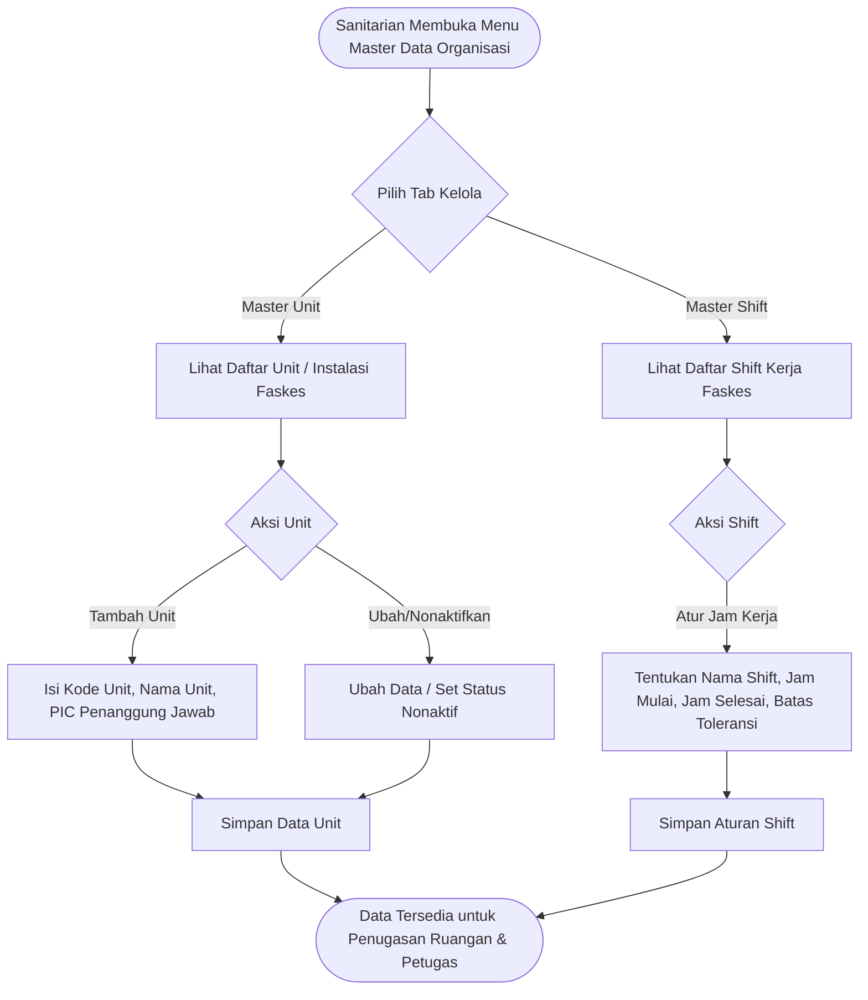

# Feature PRD: Master Data Organisasi & Shift Kerja

---

## 1. Metadata Dokumen

| Properti | Keterangan |
| :--- | :--- |
| **Kode Dokumen** | `PRD-SEHS-MD-01` |
| **Nama Modul** | Master Data Organisasi & Shift Kerja (*Department & Shift Management*) |
| **Dokumen Induk** | [`00-MASTER-PRD.md`](../../00-MASTER-PRD.md) |
| **Depends On (Prasyarat)** | • [`00-MASTER-PRD.md`](../../00-MASTER-PRD.md) (Konsep Dasar Sistem & Sasaran Mutu Faskes) • [`01-prd-auth-user.md`](../01-prd-auth-user.md) (Identitas & Hak Akses Pengawas/Sanitarian) |
| **Consumed By (Dampak)** | • [`02-md-fasilitas-ruangan-qr.md`](./02-md-fasilitas-ruangan-qr.md) (Penetapan kepemilikan unit ruangan) • Seluruh modul operasional checklist, limbah, dan analitik laporan (filter shift & unit) |
| **Versi** | 1.0.0 (Business-Centric Edition) |
| **Status** | Approved / Baseline |
| **Terakhir Diperbarui** | 2026-09-14 |
| **Target Pengguna** | Sanitarian / Pengawas Lingkungan, Kepala Bagian SDM/Umum, Tim Manajemen Faskes |

---

## 2. Latar Belakang & Masalah Bisnis

### 2.1 Masalah Nyata di Fasilitas Kesehatan
Dalam fasilitas pelayanan kesehatan (Rumah Sakit/Klinik), kegiatan sanitasi dan pemeliharaan lingkungan tidak bekerja dalam ruang hampa, melainkan terbagi ke dalam unit-unit pelayanan (misal: Rawat Inap, Kamar Bedah, Rawat Jalan) yang beroperasi selama 24 jam nonstop melalui rotasi giliran kerja (*shift*).

Kendala yang sering muncul di lapangan:
1. **Ketidakjelasan Batas Wilayah Tugas:** Sering terjadi lempar tanggung jawab kebersihan antar-petugas jika batas kewenangan unit/departemen tidak terdefinisi secara baku dalam sistem.
2. **Rekapitulasi Kinerja yang Bias Waktu:** Tanpa pencatatan shift kerja yang kaku, manajemen kesulitan menilai apakah ruangan kotor terjadi pada shift pagi, siang, atau malam.
3. **Ketidaksinkronan Jadwal Handover:** Penyerahan pekerjaan kebersihan di akhir jam dinas sering tidak terdokumentasi, sehingga temuan insiden shift sebelumnya terlewat di shift berikutnya.

### 2.2 Nilai Bisnis yang Dihasilkan
* **Akuntabilitas Kinerja per Shift:** Setiap lembar checklist, timbangan limbah, dan tiket perbaikan sarana otomatis terkorelasikan dengan giliran kerja yang bertugas saat itu.
* **Pengelompokan Laporan per Unit Pelayanan:** Manajemen dapat langsung melihat persentase kepatuhan sanitasi spesifik per instalasi (misal: membandingkan kepatuhan Ruang ICU vs Rawat Jalan).

---

## 3. Persona Pengguna & Konteks Penggunaan

| Persona | Peran dalam Master Data Ini | Konteks Penggunaan |
| :--- | :--- | :--- |
| **Sanitarian / Admin Sistem** | Pengelola Utama Master Data | Membuka Web Dashboard di ruang kantor untuk mendaftarkan nama instalasi baru dan mengatur jam kerja shift sesuai SK Direktur RS. |
| **Kepala Instalasi / Ruangan** | Penerima & Pengawas Unit | Memastikan nama unit dan pembagian area tanggung jawab tim kebersihan sudah sesuai kondisi nyata. |

---

## 4. Alur Kerja Pengelolaan (Core User Journey)

---

## 5. Kebutuhan Fungsional & Aturan Bisnis (Business Rules)

### 5.1 Fitur 1: Manajemen Master Unit / Instalasi
* **Deskripsi:** Antarmuka bagi Sanitarian untuk mendaftarkan unit atau instalasi rumah sakit sebagai payung pengelompokan ruangan dan staf.
* **Aturan Bisnis:**
  * **BR-MD01-01 (Keunikan Kode Unit):** Setiap unit wajib memiliki Kode Unit unik (misal: `IRNA` untuk Instalasi Rawat Inap, `IBS` untuk Instalasi Bedah Sentral, `KESLING` untuk Kesehatan Lingkungan, `IPSRS` untuk Pemeliharaan Sarana).
  * **BR-MD01-02 (Penanggung Jawab Unit):** Setiap unit dapat ditautkan dengan nama Pejabat/Kepala Unit (PIC) dan nomor kontak darurat untuk keperluan eskalasi temuan.
  * **BR-MD01-03 (Proteksi Data Riwayat):** Unit yang sudah memiliki ruangan dan riwayat checklist tidak boleh dihapus permanen; hanya dapat diubah statusnya menjadi `NONAKTIF`.

---

### 5.2 Fitur 2: Manajemen Master Shift Kerja
* **Deskripsi:** Antarmuka untuk mengatur konfigurasi jam kerja giliran operasional di faskes.
* **Standar Konfigurasi Shift Default:**
  * **Shift Pagi:** Jam kerja `07:00 – 14:00`
  * **Shift Siang:** Jam kerja `14:00 – 21:00`
  * **Shift Malam:** Jam kerja `21:00 – 07:00` (lintas hari/hari berikutnya)
* **Aturan Bisnis:**
  * **BR-MD01-04 (Penentuan Otomatis Berdasarkan Waktu):** Saat petugas lapangan melakukan inspeksi atau pencatatan limbah, sistem secara cerdas langsung mengaitkan transaksi tersebut ke shift kerja yang sedang aktif berdasarkan jam waktu lokal saat itu.
  * **BR-MD01-05 (Toleransi Pergantian Shift):** Diberikan batas toleransi keterlambatan serah terima (misal: 30 menit setelah jam shift berakhir) agar petugas shift sebelumnya masih dapat merampungkan input sisa pekerjaan sebelum sistem berganti shift.
  * **BR-MD01-06 (Dukungan Lintas Hari / Midnight Shift):** Sistem wajib mengenali bahwa Shift Malam yang dimulai pukul 21:00 dan berakhir pukul 07:00 keesokan harinya dihitung sebagai satu kesatuan shift kerja yang utuh.

---

## 6. Skenario Khusus & Penanganan Masalah (Edge Cases)

| Skenario Operasional | Dampak | Penanganan Sistem |
| :--- | :--- | :--- |
| **Input Lintas Jam Shift Tepat di Batas Waktu (Misal 14:00:05)** | Keraguan apakah masuk Shift Pagi atau Shift Siang. | Sistem mengacu pada batas toleransi operasional: jika input terjadi dalam toleransi handover (14:00–14:30), sistem mengizinkan petugas memilih apakah data tersebut tugas shift pagi atau awal shift siang. |
| **Perubahan Struktur Organisasi (Pemisahan / Penggabungan Unit)** | Nama unit berganti dari "Rawat Inap A" menjadi "Paviliun Cempaka". | Mengubah nama unit tidak mengubah ID unik sistem; seluruh rekam jejak audit masa lalu tetap utuh dan terhubung. |
| **Penambahan Shift Khusus (Shift Tengah / Event Audit)** | Faskes membutuhkan shift darurat (misal persiapan akreditasi). | Sanitarian dapat menambahkan shift kustom non-permanen dengan rentang jam fleksibel. |

---

## 7. Metrik Keberhasilan Bisnis (KPI)

| Indikator Kinerja | Target | Dampak Bisnis |
| :--- | :---: | :--- |
| **Akurasi Pemetaan Transaksi ke Shift** | $100\%$ | Tidak ada checklist atau limbah yang tidak bertuan tanpa identitas shift. |
| **Kelancaran Handover Antar-Shift** | $< 15\text{ menit}$ | Pergantian shift berjalan tertib dan terdata rapi. |
| **Waktu Pengaturan Struktur Organisasi** | $< 10\text{ menit}$ | Sanitarian dapat dengan cepat menyesuaikan struktur unit tanpa bantuan programmer. |

---

## 8. Kriteria Penerimaan (Acceptance Criteria)

* [ ] **AC-01 (Pengelolaan Unit Faskes):** Sanitarian dapat menambah, melihat daftar, mengubah nama, dan menonaktifkan unit pelayanan rumah sakit.
* [ ] **AC-02 (Penetapan Jam Shift):** Sanitarian dapat mengatur jam mulai dan jam selesai untuk shift Pagi, Siang, dan Malam sesuai kebijakan rumah sakit.
* [ ] **AC-03 (Auto-detect Shift):** Ketika transaksi operasional disimpan, sistem secara otomatis mengisi nama shift kerja sesuai jam transaksi berlangsung.
* [ ] **AC-04 (Penanganan Shift Malam Lintas Hari):** Shift malam yang melewati pergantian hari kalender (pukul 00:00) tetap teridentifikasi sebagai satu siklus shift kerja yang sah.
