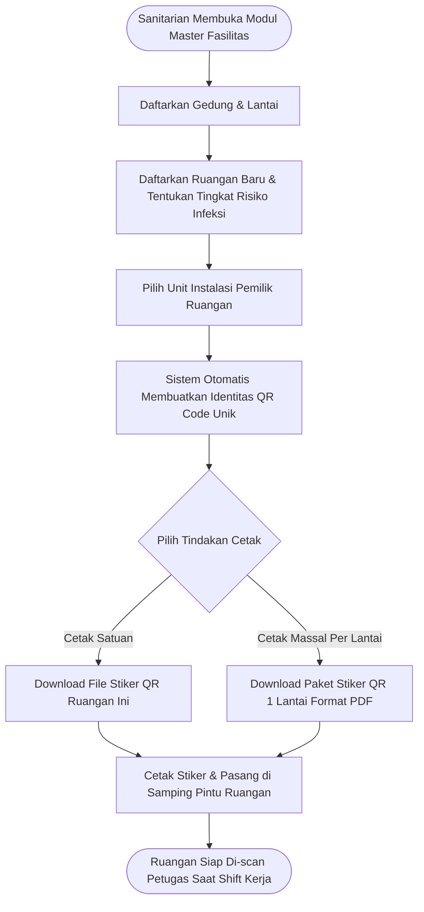

# Feature PRD: Master Data Fasilitas, Ruangan & Cetak QR Code

---

## 1. Metadata Dokumen

| Properti | Keterangan |
| :--- | :--- |
| **Kode Dokumen** | `PRD-SEHS-MD-02` |
| **Nama Modul** | Master Data Fasilitas, Ruangan & Cetak QR Code (*Facility, Room & QR Management*) |
| **Dokumen Induk** | [`00-MASTER-PRD.md`](../../00-MASTER-PRD.md) |
| **Depends On (Prasyarat)** | • [`00-MASTER-PRD.md`](../../00-MASTER-PRD.md) (Konsep Sanitasi & Pemantauan Ruangan) • [`01-prd-auth-user.md`](../01-prd-auth-user.md) (Identitas Sanitarian Pembuat Data) • [`01-md-organisasi-shift.md`](./01-md-organisasi-shift.md) (Tautan Kepemilikan Unit/Instalasi) |
| **Consumed By (Dampak)** | • `operational/01-prd-checklist-kebersihan-qr.md` (Target scan QR inspeksi ruangan) • `operational/02-prd-monitoring-limbah.md` (Ruangan asal timbulan limbah medis) • `operational/03-prd-sanitasi-air-udara.md` (Ruangan titik uji parameter udara indoor) • `operational/04-prd-temuan-tindak-lanjut.md` (Lokasi spesifik insiden kerusakan fasilitas) |
| **Versi** | 1.0.0 (Business-Centric Edition) |
| **Status** | Approved / Baseline |
| **Terakhir Diperbarui** | 2026-09-14 |
| **Target Pengguna** | Sanitarian / Tim Kesling, Bagian Rumah Tangga & Sarpras, Petugas Kebersihan Lapangan |

---

## 2. Latar Belakang & Masalah Bisnis

### 2.1 Masalah Nyata di Fasilitas Kesehatan
Dalam fasilitas pelayanan kesehatan, **ruangan fisik adalah panggung utama** dari seluruh kegiatan pengendalian infeksi dan kesehatan lingkungan. Rumah sakit memiliki ratusan hingga ribuan ruangan dengan tingkat risiko infeksi yang berbeda-beda secara drastis (misal: Ruang Bedah/OK membutuhkan perlakuan sterilitas yang jauh lebih ketat dibanding Ruang Arsip).

Kendala yang selama ini dihadapi:
1. **Audit Palsu Tanpa Hadir di Lokasi (*Ghost Inspections*):** Tanpa verifikasi fisik, sering terjadi petugas menandatangani checklist kamar padahal tidak pernah mendatangi kamar tersebut.
2. **Ketiadaan Zonasi Risiko Infeksi:** Tidak ada pembedaan perlakuan pembersihan antara ruangan infeksius berisiko tinggi dengan ruangan biasa, sehingga meningkatkan risiko *Healthcare-Associated Infections* (HAIs).
3. **Stiker QR Code Rusak / Usang:** Di lapangan, stiker QR code yang ditempel di pintu sering kali robek, terkelupas akibat disinfektan kimia, atau hilang tanpa mekanisme cetak ulang yang terkontrol.

### 2.2 Nilai Bisnis yang Dihasilkan
* **Jaminan Kehadiran Fisik 100%:** Scan QR code di pintu/dinding ruangan memastikan petugas hadir secara nyata di depan ruangan yang diperiksa.
* **Klasifikasi Risiko Sesuai Standar Akreditasi:** Mengelompokkan ruangan ke dalam kategori risiko sanitasi yang jelas untuk menentukan frekuensi inspeksi harian.
* **Sentralisasi Inventaris Fisik Gedung:** Memudahkan manajemen melacak sebaran fasilitas, kamar pasien, toilet, dan TPS di seluruh gedung.

---

## 3. Persona Pengguna & Konteks Penggunaan

| Persona | Peran dalam Master Data Ini | Konteks Penggunaan |
| :--- | :--- | :--- |
| **Sanitarian / Admin** | Pengelola Data & Cetak Stiker | Menginput master gedung, mendaftarkan nomor ruangan, dan mengunduh berkas stiker QR Code format PDF siap cetak. |
| **Petugas Lapangan** | Pengguna Stiker QR | Memindai stiker fisik QR Code di depan pintu ruangan menggunakan kamera HP sebelum mulai bekerja. |
| **Tim Sarpras / Rumah Tangga** | Penanggung Jawab Fisik | Memasang dan merawat plang/stiker QR Code akrilik di depan pintu ruangan. |

---

## 4. Alur Kerja Pengelolaan (Core User Journey)

---

## 5. Kebutuhan Fungsional & Aturan Bisnis (Business Rules)

### 5.1 Fitur 1: Manajemen Gedung & Lantai
* **Deskripsi:** Mengelola hierarki tata letak fisik fasilitas rumah sakit.
* **Aturan Bisnis:**
  * **BR-MD02-01 (Struktur Hierarki):** Setiap ruangan wajib menginduk pada 1 Lantai, dan setiap lantai wajib menginduk pada 1 Gedung (misal: *Gedung Paviliun Teratai $\rightarrow$ Lantai 2 $\rightarrow$ Kamar 201*).
  * **BR-MD02-02 (Area Terbuka / Khusus):** Sistem wajib mendukung pendaftaran area non-gedung seperti *TPS Limbah B3 Terbuka*, *Taman Luar*, *Tandon Air Bersih Utama*, dan *Instalasi Pengolahan Air Limbah (IPAL)*.

---

### 5.2 Fitur 2: Manajemen Ruangan & Klasifikasi Risiko Infeksi
* **Deskripsi:** Pendaftaran detail ruangan faskes beserta penetapan standar higienitasnya.
* **Klasifikasi Tingkat Risiko Sanitasi:**
  * **Zona Risiko Sangat Tinggi (Surgical / Immuno-compromised):** Kamar Operasi (OK), ICU, NICU, Ruang Isolasi Tekanan Negatif, Ruang Kemoterapi.
  * **Zona Risiko Tinggi:** Kamar Perawatan Pasien Rawat Inap, Ruang Bersalin (VK), IGD, Laboratorium Mikrobiologi.
  * **Zona Risiko Sedang:** Poliklinik Rawat Jalan, Ruang Radiologi, Ruang Farmasi, Toilet Umum Pengunjung.
  * **Zona Risiko Rendah:** Ruang Kantor Administrasi, Ruang Rapat, Ruang Rekam Medis, Gudang Logistik Kering.
* **Aturan Bisnis:**
  * **BR-MD02-03 (Kode Ruangan Baku):** Setiap ruangan wajib memiliki Kode Ruangan unik (misal: `OK-01`, `VIP-201`, `TOILET-LT1-A`).
  * **BR-MD02-04 (Penentu Frekuensi Checklist):** Tingkat risiko menentukan aturan frekuensi inspeksi minimal per hari (misal: *Zona Risiko Sangat Tinggi wajib diinspeksi minimal 3x sehari per shift; Zona Rendah cukup 1x sehari*).

---

### 5.3 Fitur 3: Generator & Manajemen Cetak QR Code
* **Deskripsi:** Pembuatan dan pencetakan stiker fisik QR Code untuk setiap ruangan.
* **Informasi Visual yang Dicetak pada Stiker:**
  * Logo Rumah Sakit / Faskes di bagian atas.
  * Teks Jelas: **Nama Gedung, Lantai, dan Nama Ruangan**.
  * Gambar QR Code terpusat dengan resolusi tinggi (tajam dan anti-pecah).
  * Petunjuk Ringkas: *"Pindai kode QR untuk memulai pembersihan & audit kebersihan ruangan"*.
* **Aturan Bisnis:**
  * **BR-MD02-05 (Anti-Kloning QR Code):** Kode QR berisi string identitas terenkripsi dinamis. Foto QR code dari HP lain tidak dapat disalahgunakan jika di luar toleransi validasi sistem.
  * **BR-MD02-06 (Cetak Ulang Terkontrol):** Jika stiker fisik di pintu rusak/hilang, Sanitarian dapat mencetak ulang (*re-print*) tanpa mengubah riwayat transaksi ruangan tersebut.
  * **BR-MD02-07 (Dukungan Ekspor Massal):** Tersedia tombol **"Cetak Massal (Bulk Print)"** per Gedung atau per Lantai dalam format PDF berukuran stiker standar (misal: ukuran $10 \times 15\text{ cm}$ atau $8 \times 8\text{ cm}$) sehingga memudahkan percetakan dalam jumlah banyak.

---

## 6. Skenario Khusus & Penanganan Masalah (Edge Cases)

| Skenario Lapangan | Dampak | Penanganan Sistem |
| :--- | :--- | :--- |
| **Stiker QR di Pintu Rusak / Sobek** | Petugas tidak dapat memindai QR code saat mau mulai membersihkan ruangan. | Sistem menyediakan opsi darurat bagi petugas: memilih nama ruangan secara manual dari daftar dengan melampirkan alasan *"QR Code Rusak"*. Sistem otomatis mengirim notifikasi ke Sanitarian untuk mencetak stiker pengganti. |
| **Kamera HP Petugas Buram / Gelap** | Kamera sulit membaca QR di lorong remang-remang. | Antarmuka pemindai dilengkapi tombol **Nyalakan Senter (Flashlight)** otomatis di layar aplikasi PWA. |
| **Renovasi / Alih Fungsi Ruangan** | Ruang poli bedah dialihfungsikan menjadi kamar rawat inap biasa. | Sanitarian dapat mengubah klasifikasi risiko ruangan tanpa menghapus ruangan; histori kepatuhan lama tetap tercatat sesuai tanggal perubahannya. |

---

## 7. Metrik Keberhasilan Bisnis (KPI)

| Indikator Kinerja | Target | Dampak Bisnis |
| :--- | :---: | :--- |
| **Cakupan Labelisasi Ruangan Faskes** | $100\%$ | Seluruh ruangan yang wajib diaudit memiliki stiker QR resmi yang terpasang rapi. |
| **Kecepatan Cetak Ulang Stiker Pengganti** | $< 5\text{ menit}$ | Tidak ada ruangan yang tertunda pemantauannya karena stiker rusak. |
| **Eliminasi Pemindaian Fiktif** | $100\%$ | Menghilangkan manipulasi paraf tanda tangan tanpa inspeksi fisik. |

---

## 8. Kriteria Penerimaan (Acceptance Criteria)

* [ ] **AC-01 (Pengelolaan Gedung & Lantai):** Sanitarian dapat membuat, memperbarui, dan menyusun hierarki bangunan faskes dengan benar.
* [ ] **AC-02 (Pendaftaran Ruangan & Kategori Risiko):** Sanitarian dapat mendaftarkan ruangan dengan memilih tingkat risiko sanitasi (Sangat Tinggi, Tinggi, Sedang, Rendah).
* [ ] **AC-03 (Generator Lembar Stiker QR):** Sistem mampu menghasilkan berkas PDF stiker QR Code siap cetak dengan tata letak rapi, memuat logo faskes, nama ruangan, dan kode QR beresolusi tinggi.
* [ ] **AC-04 (Cetak Massal per Lantai):** Sanitarian dapat mengunduh seluruh stiker QR code dalam satu lantai sekaligus hanya dengan sekali klik.
