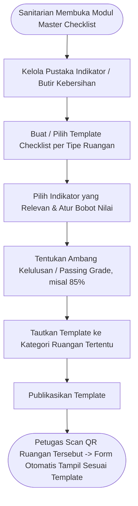

# Feature PRD: Master Data Standar Checklist & Template Audit

---

## 1. Metadata Dokumen

| Properti | Keterangan |
| :--- | :--- |
| **Kode Dokumen** | `PRD-SEHS-MD-03` |
| **Nama Modul** | Master Data Standar Checklist & Template Audit (*Inspection Checklist Templates*) |
| **Dokumen Induk** | [`00-MASTER-PRD.md`](../../00-MASTER-PRD.md) |
| **Depends On (Prasyarat)** | • [`00-MASTER-PRD.md`](../../00-MASTER-PRD.md) (Standar Kepatuhan Sanitasi & Kebersihan Faskes) • [`01-prd-auth-user.md`](../01-prd-auth-user.md) (Akses Sanitarian Pengatur Standar) • [`02-md-fasilitas-ruangan-qr.md`](./02-md-fasilitas-ruangan-qr.md) (Tipe & Kategori Risiko Ruangan) |
| **Consumed By (Dampak)** | • `operational/01-prd-checklist-kebersihan-qr.md` (Menentukan form input inspeksi dinamis saat petugas memindai QR ruangan) |
| **Versi** | 1.0.0 (Business-Centric Edition) |
| **Status** | Approved / Baseline |
| **Terakhir Diperbarui** | 2026-09-14 |
| **Target Pengguna** | Sanitarian / Pengawas Lingkungan, Komite Pencegahan & Pengendalian Infeksi (PPI) |

---

## 2. Latar Belakang & Masalah Bisnis

### 2.1 Masalah Nyata di Fasilitas Kesehatan
Dalam operasional sanitasi rumah sakit, **kebutuhan audit kebersihan bersifat kontekstual dan spesifik**. Formulir kebersihan untuk Kamar Operasi (OK) tidak boleh sama dengan formulir untuk toilet umum atau ruang kantor direksi.

Kendala yang terjadi jika standar checklist tidak dikelola secara fleksibel:
1. **Form Kaku & Tidak Relevan:** Jika satu form digunakan untuk semua ruangan, petugas di ruang administrasi dipaksa memeriksa indikator yang tidak ada (misal: "kondisi bed pasien" di ruang rapat).
2. **Ketiadaan Bobot Penilaian Kritis:** Kotoran pada lantai ruang rawat inap tidak boleh disamakan bobot bahayanya dengan ketiadaan sabun antiseptik cuci tangan di ruang isolasi infeksius.
3. **Standar Akreditasi yang Berubah:** Rumah sakit sering memperbarui standar kebersihan mengikuti pedoman terbaru Kemenkes atau standar akreditasi (KARS/JCI); perubahan ini harus bisa diterapkan seketika tanpa perlu merombak aplikasi.

### 2.2 Nilai Bisnis yang Dihasilkan
* **Form Inspeksi Dinamis Sesuai Ruangan:** Begitu petugas memindai QR code, formulir yang tampil otomatis menyesuaikan tipe ruangan yang bersangkutan.
* **Perhitungan Skor Kepatuhan Objektif (*Objective Compliance Scoring*):** Sistem otomatis menghitung persentase kebersihan ruangan berdasarkan bobot indikator yang telah ditetapkan komite sanitasi.
* **Pencegahan Temuan Berulang (*Quality Standardization*):** Menyeragamkan pemahaman seluruh staf kebersihan mengenai apa arti "Lantai Bersih" atau "Wastafel Siap Pakai".

---

## 3. Persona Pengguna & Konteks Penggunaan

| Persona | Peran dalam Master Data Ini | Konteks Penggunaan |
| :--- | :--- | :--- |
| **Sanitarian / Komite PPI** | Perancang Standar Mutu | Menyusun pustaka indikator kebersihan dan merakit template formulir inspeksi per kategori ruangan melalui Web Admin. |
| **Petugas Lapangan (CS)** | Pengisi Checklist | Mengisi butir-butir checklist di layar HP sesuai template yang muncul setelah scan QR. |

---

## 4. Alur Kerja Pengelolaan (Core User Journey)

---

## 5. Kebutuhan Fungsional & Aturan Bisnis (Business Rules)

### 5.1 Fitur 1: Pustaka Indikator & Butir Kebersihan
* **Deskripsi:** Bank data seluruh aspek fisik yang menjadi objek inspeksi sanitasi dan higienitas di lingkungan faskes.
* **Daftar Indikator Standar Rumah Sakit:**
  1. *Lantai:* Bersih, kering, tidak berdebu, tidak lengket, tidak berbau.
  2. *Wastafel & Saluran Air:* Kran berfungsi normal, air jernih mengalir lancar, tidak tersumbat, tidak ada kerak/lumut.
  3. *Tempat Sampah:* Terpilah (kantong kuning medis vs kantong hitam domestik), tertutup rapi, isi belum melampaui $\frac{3}{4}$ kapasitas.
  4. *Sarana Cuci Tangan:* Sabun cuci tangan cair terisi, cairan handrub berbasis alkohol tersedia, tisu pengering tersedia.
  5. *Tempat Tidur Pasien & Mebel:* Sprei/linen bersih dan rapi, tiang infus bersih, nakas pasien bebas debu.
  6. *Dinding & Plafon:* Bebas sarang laba-laba, tidak ada rembesan air/bocor, cat tidak terkelupas.
  7. *Kerapian & Bau:* Ruangan bebas dari bau menyengat, ventilasi udara terasa segar.
* **Aturan Bisnis:**
  * **BR-MD03-01 (Tipe Respon yang Didukung):** Setiap indikator dapat diatur tipe responnya:
    * *Pilihan Sesuai / Tidak Sesuai (Pass / Fail)* — paling umum untuk kecepatan input petugas lapangan.
    * *Skala Nilai (1–5 bintang)* — untuk audit kepuasan mendalam oleh sanitarian.

---

### 5.2 Fitur 2: Manajemen Template Formulir per Tipe Ruangan
* **Deskripsi:** Menggabungkan butir-butir indikator terpilih menjadi 1 paket formulir yang terikat dengan tipe ruangan.
* **Contoh Pemetaan Template Bawaan:**
  * **Template Ruang Operasi / ICU (Risiko Sangat Tinggi):** Wajib memeriksa 12 indikator ketat (sterilitas, ketersediaan handrub bedah, tidak ada tumpahan, saluran udara). Ambang kelulusan: **100% Wajib Lulus**.
  * **Template Kamar Pasien Rawat Inap (Risiko Tinggi):** Memeriksa 8 indikator (kebersihan bed, toilet, wastafel, pemilahan sampah, lantai). Ambang kelulusan: **$\ge 85\%$**.
  * **Template Toilet Umum Pengunjung:** Memeriksa 5 indikator (lantai kering anti-licin, kran air, sabun, tempat sampah, bau). Ambang kelulusan: **$\ge 90\%$**.
  * **Template Ruang Kantor Administrasi:** Memeriksa 4 indikator (lantai, tempat sampah non-medis, debu meja, kerapian). Ambang kelulusan: **$\ge 75\%$**.
* **Aturan Bisnis:**
  * **BR-MD03-02 (Indikator Wajib / Fatal Item):** Sanitarian dapat menandai indikator tertentu sebagai **"Critical / Fatal Item"** (misal: *Jika tempat sampah medis tercampur sampah umum, atau kran wastafel mati total, ruangan OTOMATIS dinyatakan GAGAL AUDIT meskipun indikator lain bersih*).
  * **BR-MD03-03 (Auto-Trigger Temuan Insiden):** Jika saat inspeksi terdapat indikator yang bernilai "Tidak Sesuai" atau skor total di bawah *passing grade*, sistem otomatis memunculkan form pelaporan temuan tiket perbaikan.
  * **BR-MD03-04 (Versioning Template):** Jika Sanitarian mengubah template checklist, perubahan hanya berlaku untuk inspeksi yang dilakukan setelah tanggal perubahan; rekap kepatuhan historis bulan lalu tidak terganggu.

---

## 6. Skenario Khusus & Penanganan Masalah (Edge Cases)

| Skenario Lapangan | Dampak | Penanganan Sistem |
| :--- | :--- | :--- |
| **Ruangan Baru Belum Diatur Templatenya** | Ruangan terdaftar tapi lupa dipasangkan template checklist. | Sistem otomatis menerapkan **Template Standar Umum (Default Template)** agar petugas lapangan tidak terhalang untuk melakukan pembersihan. |
| **Perubahan Standar Akreditasi Mendadak** | Ada penambahan indikator baru dari Kemenkes (misal: "Pemeriksaan HEPA Filter"). | Sanitarian cukup menambahkan indikator tersebut ke Template Ruang Bedah; seketika pada shift berikutnya seluruh petugas di ruang bedah langsung mendapatkan butir pertanyaan baru tersebut. |

---

## 7. Metrik Keberhasilan Bisnis (KPI)

| Indikator Kinerja | Target | Dampak Bisnis |
| :--- | :---: | :--- |
| **Tingkat Relevansi Pertanyaan Form** | $100\%$ | Tidak ada pertanyaan yang tidak masuk akal di ruangan yang diperiksa. |
| **Kecepatan Waktu Pengisian Petugas** | $< 45\text{ detik/ruangan}$ | Petugas tidak terbebani form rumit dan fokus pada pekerjaan fisik pembersihan. |
| **Deteksi Otomatis Kondisi Kritis** | $100\%$ akurat | Insiden kebersihan kritis (misal tumpahan infeksius) langsung tereskalasi tanpa tertunda. |

---

## 8. Kriteria Penerimaan (Acceptance Criteria)

* [ ] **AC-01 (Kustomisasi Pustaka Indikator):** Sanitarian dapat menambah, mengedit, dan mengkategorikan butir indikator kebersihan sesuai regulasi faskes.
* [ ] **AC-02 (Perakitan Template):** Sanitarian dapat membuat template formulir baru, memilih butir indikator, dan menentukan nilai ambang kelulusan (*passing grade*).
* [ ] **AC-03 (Fitur Fatal Item):** Jika indikator bertanda "Fatal / Critical" dinyatakan gagal saat inspeksi, sistem otomatis menggagalkan status audit ruangan tersebut.
* [ ] **AC-04 (Penyelarasan Dinamis):** Saat petugas memindai QR code ruangan rawat inap, form yang muncul di layar HP sesuai dengan template rawat inap, bukan template kantor atau toilet.
