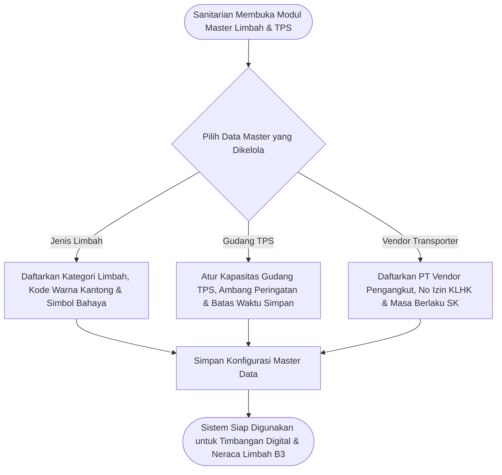

# Feature PRD: Master Data Limbah, TPS & Vendor Transporter

---

## 1. Metadata Dokumen

| Properti | Keterangan |
| :--- | :--- |
| **Kode Dokumen** | `PRD-SEHS-MD-04` |
| **Nama Modul** | Master Data Limbah, TPS & Vendor (*Waste Classification, Storage & Transporter*) |
| **Dokumen Induk** | [`00-MASTER-PRD.md`](../../00-MASTER-PRD.md) |
| **Depends On (Prasyarat)** | • [`00-MASTER-PRD.md`](../../00-MASTER-PRD.md) (Regulasi Pengelolaan Limbah Faskes Kemenkes & KLHK) • [`01-prd-auth-user.md`](../01-prd-auth-user.md) (Identitas Sanitarian & Petugas TPS) • [`02-md-fasilitas-ruangan-qr.md`](./02-md-fasilitas-ruangan-qr.md) (Lokasi Fisik Ruangan Penghasil & Gudang TPS) |
| **Consumed By (Dampak)** | • `operational/02-prd-monitoring-limbah.md` (Pencatatan penimbangan limbah, neraca B3, peringatan kapasitas TPS, dan manifes penyerahan vendor) |
| **Versi** | 1.0.0 (Business-Centric Edition) |
| **Status** | Approved / Baseline |
| **Terakhir Diperbarui** | 2026-09-14 |
| **Target Pengguna** | Sanitarian / Pengawas Lingkungan, Porter Pengangkut Limbah, Penanggung Jawab TPS Limbah B3 |

---

## 2. Latar Belakang & Masalah Bisnis

### 2.1 Masalah Nyata di Fasilitas Kesehatan
Pengelolaan limbah medis Bahan Berbahaya dan Beracun (B3) adalah **area kepatuhan hukum paling kritis** bagi fasilitas pelayanan kesehatan. Pelanggaran terhadap tata kelola limbah B3 dapat berujung pada sanksi pidana lingkungan hidup, pencabutan izin operasional rumah sakit, serta bahaya infeksi silang dan kecelakaan kerja bagi petugas penanganan limbah.

Kendala nyata yang dihadapi faskes:
1. **Pencampuran Jenis Limbah di Ruangan:** Staf sering salah membuang sampah domestik ke kantong kuning limbah medis (menyebabkan biaya pemusnahan membengkak) atau sebaliknya sampah jarum suntik terbuang ke kantong hitam (berisiko tertusuk petugas kebersihan).
2. **Pelanggaran Batas Waktu Simpan TPS:** Regulasi mewajibkan limbah infeksius pada suhu ruang disimpan **maksimal 48 jam ($2 \times 24$ jam)** sebelum dimusnahkan/diangkut. Tanpa sistem pemantau batas kedaluwarsa, limbah sering menumpuk melebihi batas waktu aman.
3. **Ketiadaan Legalitas Vendor Pengangkut:** Rumah sakit wajib bermitra hanya dengan transporter yang memiliki izin resmi KLHK yang masih berlaku; sering kali masa berlaku izin vendor habis tanpa disadari oleh pihak manajemen rumah sakit.

### 2.2 Nilai Bisnis yang Dihasilkan
* **Kepatuhan Hukum 100% (*Zero Legal Violation*):** Menjamin pelacakan limbah sesuai standar PP No. 22 Tahun 2021 dan Permen LHK tentang Pengelolaan Limbah B3 Faskes.
* **Penghematan Biaya Pengolahan Limbah:** Pemilahan yang benar mencegah sampah non-medis masuk ke alur pemusnahan limbah B3 yang berbiaya mahal per kilogramnya.
* **Pencegahan Kelebihan Muatan TPS (*Anti-Overflow*):** Memberikan visibilitas batas kapasitas gudang TPS sebelum terjadi penumpukan limbah berbahaya.

---

## 3. Persona Pengguna & Konteks Penggunaan

| Persona | Peran dalam Master Data Ini | Konteks Penggunaan |
| :--- | :--- | :--- |
| **Sanitarian / Penanggung Jawab B3** | Pengelola Parameter & Legalitas | Mendaftarkan jenis limbah, mengatur batas kuota TPS, dan mengunggah masa berlaku izin vendor pihak ketiga via Web Admin. |
| **Petugas / Porter TPS** | Pengguna Data Transaksi | Menimbang limbah di TPS dan memilih jenis limbah serta vendor pengangkut sesuai data master yang telah diverifikasi. |

---

## 4. Alur Kerja Pengelolaan (Core User Journey)

---

## 5. Kebutuhan Fungsional & Aturan Bisnis (Business Rules)

### 5.1 Fitur 1: Manajemen Kategori & Jenis Limbah
* **Deskripsi:** Pustaka jenis-jenis limbah yang dihasilkan oleh aktivitas faskes beserta standarisasi wadahnya.
* **Klasifikasi Baku Limbah Faskes:**
  * **Limbah Medis B3 Infeksius:** Kantong Plastik Kuning (kassa darah, perban, sarung tangan terkontaminasi).
  * **Limbah Benda Tajam (*Sharps*):** Wadah Kaku Anti-Tembus / *Safety Box* Kuning (jarum suntik, bisturi, ampul pecah).
  * **Limbah Patologi & Anatomi:** Kantong Kuning Bertanda Khusus (jaringan tubuh, plasenta).
  * **Limbah Kimia & Farmasi / Sitotoksik:** Kantong Plastik Cokelat / Ungu (obat kedaluwarsa, sisa kemoterapi, reagen lab).
  * **Limbah Domestik / Organik:** Kantong Plastik Hitam (sisa makanan, daun, sampah dapur).
  * **Limbah Daur Ulang / Kering:** Kantong Plastik Biru / Bening (kardus obat kering, botol plastik non-infeksius).
* **Aturan Bisnis:**
  * **BR-MD04-01 (Label Warna Wajib):** Setiap jenis limbah wajib memiliki kode warna standar visual yang ditampilkan seragam di aplikasi mobile petugas untuk meminimalkan kesalahan pilih.
  * **BR-MD04-02 (Satuan Berat Standar):** Seluruh pencatatan kuantitas limbah diwajibkan menggunakan satuan baku **Kilogram (Kg)** dengan presisi desimal minimal 2 angka di belakang koma (misal: `2.45 Kg`).

---

### 5.2 Fitur 2: Manajemen Tempat Penampungan Sementara (TPS)
* **Deskripsi:** Pendaftaran gudang atau depo TPS limbah B3 dan TPS domestik di lingkungan rumah sakit.
* **Parameter Pengaturan TPS:**
  * Kapasitas Maksimal Penyimpanan (dalam satuan Kilogram atau $m^3$).
  * Ambang Batas Waspada / *Warning Threshold* (default: **$80\%$ dari kapasitas maksimal**).
  * Batas Waktu Simpan Suhu Kamar (default: **Maksimal $2 \times 24$ jam / 48 jam**).
  * Batas Waktu Simpan dengan Mesin Pendingin / *Cold Storage* (default: **Maksimal 90 hari** pada suhu $< 0^\circ\text{C}$).
* **Aturan Bisnis:**
  * **BR-MD04-03 (Alarm Kuota Penuh):** Jika akumulasi timbulan limbah yang masuk ke TPS telah mencapai $\ge 80\%$, sistem otomatis menampilkan status kuning (*Waspada*) di dashboard manajemen. Jika $\ge 100\%$, status menjadi merah (*Kritis / Overload*).
  * **BR-MD04-04 (Alarm Masa Simpan / Aging Alert):** Sistem wajib melacak waktu masuk limbah; jika ada kantong limbah yang tersimpan $> 36\text{ jam}$ di TPS suhu ruang tanpa jadwal angkut, sistem wajib membunyikan peringatan dini ke Sanitarian.

---

### 5.3 Fitur 3: Manajemen Vendor Transporter (Pihak Ketiga)
* **Deskripsi:** Pendaftaran mitra rekanan pengangkut dan pemusnah limbah B3 berizin resmi.
* **Data Legalitas yang Dicatat:**
  * Nama Perusahaan (PT) Transporter dan Pengolah Akhir (Insinerator/Autoclave).
  * Nomor Izin Operasional Pengangkutan Limbah B3 dari Kementerian Lingkungan Hidup dan Kehutanan (KLHK).
  * Tanggal Jatuh Tempo / Masa Berlaku Izin.
  * Daftar Nomor Polisi Kendaraan (Armada Truk Berizin) dan Nama Pengemudi.
* **Aturan Bisnis:**
  * **BR-MD04-05 (Proteksi Izin Kedaluwarsa):** Jika masa berlaku izin vendor telah habis (*expired*), sistem otomatis memblokir nama vendor tersebut dari form serah terima pengangkutan limbah sampai Sanitarian memperbarui dokumen izin baru.
  * **BR-MD04-06 (Peringatan Jatuh Tempo 30 Hari):** Sistem memunculkan notifikasi peringatan di dashboard Sanitarian **30 hari sebelum izin vendor berakhir** agar proses perpanjangan kontrak dapat segera diproses.

---

## 6. Skenario Khusus & Penanganan Masalah (Edge Cases)

| Skenario Lapangan | Dampak | Penanganan Sistem |
| :--- | :--- | :--- |
| **Vendor Mengirim Truk Pengganti Non-Izin** | Nomor polisi truk tidak ada di daftar master saat serah terima. | Sistem menolak input serah terima kecuali Sanitarian melakukan verifikasi manual dan mengunggah surat jalan darurat dari vendor. |
| **Timbangan TPS Rusak Mendadak** | Petugas TPS tidak bisa input timbangan desimal. | Sistem menyediakan opsi darurat "Input Estimasi Kantong" dengan catatan wajib ditimbang ulang saat timbangan kembali normal. |
| **Limbah Medis Menumpuk Akibat Hari Libur Nasional** | Vendor tidak beroperasi selama libur panjang. | Jika TPS memiliki fasilitas *Cold Storage*, Sanitarian dapat mengalihkan status simpan ke mode "Pendingin", sehingga batas waktu simpan otomatis diperpanjang menjadi 90 hari sesuai regulasi. |

---

## 7. Metrik Keberhasilan Bisnis (KPI)

| Indikator Kinerja | Target | Dampak Bisnis |
| :--- | :---: | :--- |
| **Kepatuhan Masa Simpan TPS ($< 48$ Jam)** | $100\%$ | Tidak ada pelanggaran batas waktu simpan limbah B3 suhu ruang. |
| **Validitas Izin Vendor Pengangkut** | $100\%$ aktif | Faskes terlindungi dari risiko hukum bekerjasama dengan pihak ketiga ilegal. |
| **Pencegahan TPS Over-Capacity** | $0\text{ insiden}$ | Tidak ada limbah medis yang tercecer di luar batas pagar gudang TPS. |

---

## 8. Kriteria Penerimaan (Acceptance Criteria)

* [ ] **AC-01 (Daftar Kategori Limbah Lengkap):** Sistem menyediakan klasifikasi limbah medis (infeksius, benda tajam, sitotoksik) dan non-medis dengan kode warna standar.
* [ ] **AC-02 (Kalkulasi Kuota & Ambang TPS):** Sistem dapat menampilkan persentase kapasitas TPS yang terpakai dan membunyikan peringatan saat melampaui $80\%$.
* [ ] **AC-03 (Peringatan Izin Vendor):** Sistem secara visual memperingatkan Sanitarian jika masa berlaku izin pengangkutan vendor sisa $< 30$ hari.
* [ ] **AC-04 (Pemblokiran Vendor Nonaktif/Kedaluwarsa):** Vendor yang izinnya kedaluwarsa tidak dapat dipilih pada transaksi serah terima pengangkutan limbah.
