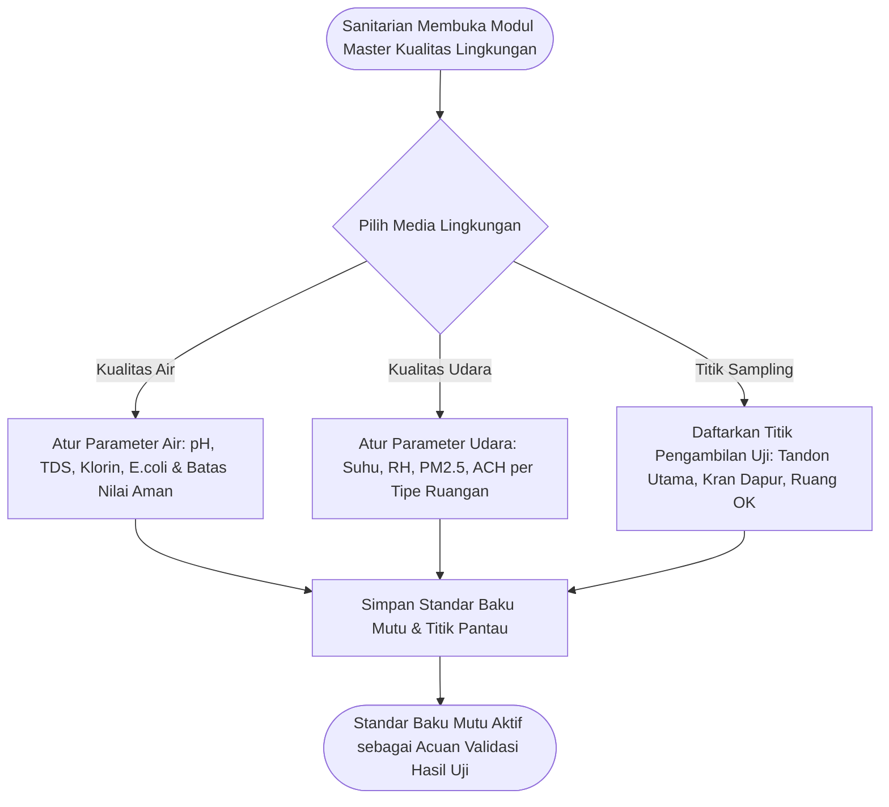

# Feature PRD: Master Data Baku Mutu Sanitasi Air & Udara

---

## 1. Metadata Dokumen

| Properti | Keterangan |
| :--- | :--- |
| **Kode Dokumen** | `PRD-SEHS-MD-05` |
| **Nama Modul** | Master Data Baku Mutu Sanitasi Air & Udara (*Environmental Quality Benchmarks*) |
| **Dokumen Induk** | [`00-MASTER-PRD.md`](../../00-MASTER-PRD.md) |
| **Depends On (Prasyarat)** | • [`00-MASTER-PRD.md`](../../00-MASTER-PRD.md) (Regulasi Baku Mutu Kesehatan Lingkungan Permenkes No. 2/2023) • [`01-prd-auth-user.md`](../01-prd-auth-user.md) (Akses Sanitarian Pengelola Baku Mutu) • [`02-md-fasilitas-ruangan-qr.md`](./02-md-fasilitas-ruangan-qr.md) (Lokasi Fisik Ruangan Titik Uji Sampling) |
| **Consumed By (Dampak)** | • `operational/03-prd-sanitasi-air-udara.md` (Acuan validasi input hasil uji lab berkala dan ambang batas peringatan sensor IoT) |
| **Versi** | 1.0.0 (Business-Centric Edition) |
| **Status** | Approved / Baseline |
| **Terakhir Diperbarui** | 2026-09-14 |
| **Target Pengguna** | Sanitarian / Petugas Laboratorium Kesling, Tim Pemeliharaan Sarana (IPSRS) |

---

## 2. Latar Belakang & Masalah Bisnis

### 2.1 Masalah Nyata di Fasilitas Kesehatan
Kualitas media lingkungan fisik di rumah sakit—khususnya **air bersih/minum** dan **udara ruangan**—berpengaruh langsung terhadap keselamatan pasien, keberhasilan tindakan operasi bedah, dan pencegahan penularan penyakit menular melalui udara (*airborne infections* seperti TBC).

Tantangan nyata di lapangan:
1. **Pencatatan Hasil Uji yang Tercecer di Buku Kertas:** Hasil pemeriksaan berkala sanitarian (misal tes pH air tandon, sisa klorin, atau pengukuran partikel debu $PM_{2.5}$) sering tersimpan di binder lembaran terpisah tanpa ada visualisasi tren historis.
2. **Keterlambatan Deteksi Pencemaran:** Ketika parameter air mengalami anomali (misal sisa klorin drop atau bakteri E. coli positif), manajemen baru mengetahuinya berhari-hari kemudian setelah ada komplain diare atau infeksi luka operasi.
3. **Standar Ruang Khusus yang Berbeda-beda:** Ruang isolasi infeksius membutuhkan pertukaran udara minimal 12 kali per jam (ACH) dan tekanan negatif, sedangkan kamar operasi membutuhkan tekanan positif; perbedaan parameter ini sulit dipantau manual tanpa batasan baku mutu sistemik.

### 2.2 Nilai Bisnis yang Dihasilkan
* **Deteksi Dini Bahaya Lingkungan (*Early Warning System*):** Sistem otomatis mengubah status visual menjadi Kuning (*Waspada*) atau Merah (*Bahaya*) begitu ada angka hasil uji yang melenceng dari baku mutu Permenkes.
* **Kesiapan Dokumen Akreditasi Rumah Sakit:** Seluruh data pemantauan kualitas air dan udara tersimpan rapi dalam bentuk grafik tren historis yang siap diaudit asesor akreditasi (KARS/JCI).
* **Integrasi Bertahap IoT:** Master data ini siap digunakan baik untuk pencatatan manual sanitarian saat ini maupun penerimaan data otomatis sensor IoT di masa depan.

---

## 3. Persona Pengguna & Konteks Penggunaan

| Persona | Peran dalam Master Data Ini | Konteks Penggunaan |
| :--- | :--- | :--- |
| **Sanitarian / Laboran Kesling** | Penentu Baku Mutu & Titik Uji | Menentukan daftar parameter uji, nilai batas aman sesuai Permenkes, dan mendaftarkan titik kran/ruangan sampling di faskes. |
| **Teknisi IPSRS / Sarpras** | Pemantau Kinerja Mesin | Mengacu pada baku mutu udara untuk jadwal penggantian filter HEPA AC dan perawatan sistem pengolahan air bersih (WTP). |

---

## 4. Alur Kerja Pengelolaan (Core User Journey)

---

## 5. Kebutuhan Fungsional & Aturan Bisnis (Business Rules)

### 5.1 Fitur 1: Manajemen Baku Mutu Kualitas Air
* **Deskripsi:** Pustaka parameter fisik, kimia, dan mikrobiologi air bersih dan air minum rumah sakit.
* **Tabel Baku Mutu Standar Acuan (Permenkes RI):**
  * **pH (Derajat Keasaman):** Batas aman: `6.5 – 8.5`
  * **Total Dissolved Solids (TDS):** Batas aman: `< 300 mg/L (ppm)` untuk air minum, `< 1000 mg/L` untuk air bersih.
  * **Kekeruhan (*Turbidity*):** Batas aman: `< 3 NTU` untuk air minum, `< 25 NTU` untuk air bersih.
  * **Sisa Klorin Bebas:** Batas aman: `0.2 – 0.5 mg/L (ppm)` di titik kran terjauh distribusi tandon.
  * **Bakteri E. coli / Coliform Total:** Batas aman: **`0 CFU per 100 mL sampel` (Wajib Nol / Negatif)**.
* **Aturan Bisnis:**
  * **BR-MD05-01 (Parameter Kritis Air):** Parameter mikrobiologi (*E. coli*) dan sisa klorin ditandai sebagai indikator kritis; jika ada sampel air dengan $E. coli > 0$, sistem otomatis mengirimkan peringatan darurat ke Direksi dan Tim IPSRS untuk pengurasan tandon.

---

### 5.2 Fitur 2: Manajemen Baku Mutu Kualitas Udara Indoor
* **Deskripsi:** Standar parameter iklim mikro dan kebersihan udara di dalam ruangan faskes.
* **Standar Parameter Udara per Zona:**
  * **Kamar Operasi (OK) & Bedah:** Suhu `19 – 24°C`, Kelembaban relatif `40 – 60%`, Pertukaran udara minimal `15 – 20x / jam (ACH)`, Tekanan Udara: Positif.
  * **Ruang Isolasi Infeksius (Airborne / TBC):** Tekanan Udara: Negatif, Pertukaran udara minimal `12x / jam (ACH)`.
  * **Ruang Rawat Inap & ICU:** Suhu `22 – 26°C`, Kelembaban relatif `40 – 60%`, Partikulat Halus $PM_{2.5} < 25\text{ }\mu\text{g}/m^3$, $PM_{10} < 50\text{ }\mu\text{g}/m^3$.
* **Aturan Bisnis:**
  * **BR-MD05-02 (Ambang Tiga Warna / Traffic Light Status):** Setiap parameter wajib memiliki 3 tingkatan status:
    * 🟢 **Hijau (Aman / Sesuai Baku Mutu):** Nilai berada dalam rentang standar normal.
    * 🟡 **Kuning (Waspada):** Nilai mendekati batas toleransi (deviasi $\pm 10\%$).
    * 🔴 **Merah (Bahaya / Anomali):** Nilai melampaui batas aman Permenkes (otomatis memicu pembuatan tiket investigasi).

---

### 5.3 Fitur 3: Manajemen Titik Sampling / Titik Pantau
* **Deskripsi:** Inventarisasi titik-titik fisik lokasi pengambilan sampel air dan pemantauan udara.
* **Aturan Bisnis:**
  * **BR-MD05-03 (Identitas Titik Sampling):** Setiap titik pantau wajib memiliki:
    * Nama Titik (misal: *Kran Tandon Utama Gedung A*, *Kran Westafel Dapur Gizi*, *Udara Kamar Bedah 1*).
    * Lokasi Fisik (terhubung dengan Master Gedung & Ruangan di `02-md-fasilitas-ruangan-qr.md`).
    * Jadwal Rutinitas Pengujian (Harian, Mingguan, atau Bulanan).
  * **BR-MD05-04 (Pencegahan Sampel Terlewat):** Sistem memantau kepatuhan jadwal; jika titik sampling terjadwal bulanan belum diisi hingga akhir bulan, sistem memunculkan indikator audit tertunda (*overdue sampling*).

---

## 6. Skenario Khusus & Penanganan Masalah (Edge Cases)

| Skenario Lapangan | Dampak | Penanganan Sistem |
| :--- | :--- | :--- |
| **Hasil Uji Laboratorium Eksternal Datang Terlambat** | Sampel air dikirim ke Balai Labkesda dan hasil uji kultur bakteri baru keluar 7 hari kemudian. | Sanitarian dapat menginput tanggal pengambilan sampel riil di masa lalu; grafik historis tetap mencatat data sesuai tanggal pengambilan sampel fisik, bukan tanggal input laporan. |
| **Sensor IoT Udara Rusak / Kirim Angka Ekstrem (Outlier)** | Sensor suhu mengirim data 99°C akibat lonjakan listrik. | Sistem memiliki filter batas kewajaran nilai (*sanity check*): angka anomali ekstrem ditandai sebagai "Kemungkinan Sensor Rusak / Butuh Kalibrasi", bukan langsung menyalakan alarm kebakaran. |

---

## 7. Metrik Keberhasilan Bisnis (KPI)

| Indikator Kinerja | Target | Dampak Bisnis |
| :--- | :---: | :--- |
| **Kepatuhan Terhadap Standar Permenkes** | $100\%$ | Tidak ada baku mutu yang salah pasang atau melanggar regulasi pemerintah. |
| **Kecepatan Respons Anomali Lingkungan** | $< 15\text{ menit}$ | Masalah kualitas air/udara langsung terdeteksi sebelum membahayakan pasien. |
| **Kelengkapan Titik Sampling Rutin** | $\ge 95\%$ | Tidak ada tandon atau ruang steril yang lolos dari jadwal pengujian berkala. |

---

## 8. Kriteria Penerimaan (Acceptance Criteria)

* [ ] **AC-01 (Kustomisasi Baku Mutu Air):** Sanitarian dapat mengatur nilai minimal dan maksimal untuk pH, TDS, sisa klorin, dan bakteri E. coli.
* [ ] **AC-02 (Kustomisasi Baku Mutu Udara per Zona):** Sanitarian dapat mengatur standar suhu, kelembaban, dan ACH yang berbeda antara Ruang Bedah, Isolasi, dan Rawat Inap.
* [ ] **AC-03 (Pendaftaran Titik Sampling):** Seluruh titik kran air dan titik uji udara dapat didaftarkan dan ditautkan dengan gedung serta ruangan yang relevan.
* [ ] **AC-04 (Indikator Status Visual Tiga Warna):** Sistem dapat secara akurat mengklasifikasikan angka hasil uji menjadi status Hijau, Kuning, atau Merah berdasarkan batas baku mutu yang aktif.
