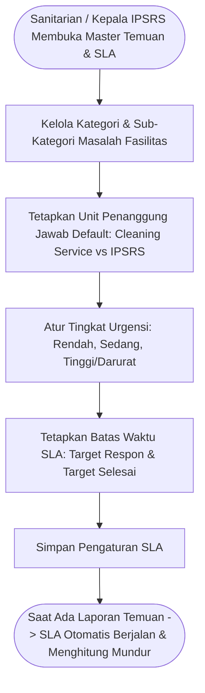

# Feature PRD: Master Data Kategori Temuan & Standar SLA

---

## 1. Metadata Dokumen

| Properti | Keterangan |
| :--- | :--- |
| **Kode Dokumen** | `PRD-SEHS-MD-06` |
| **Nama Modul** | Master Data Kategori Temuan & Standar SLA (*Incident Categories & Service Level Agreement*) |
| **Dokumen Induk** | [`00-MASTER-PRD.md`](../../00-MASTER-PRD.md) |
| **Depends On (Prasyarat)** | • [`00-MASTER-PRD.md`](../../00-MASTER-PRD.md) (Alur Penanganan Insiden & Tiket Perbaikan Sarana) • [`01-prd-auth-user.md`](../01-prd-auth-user.md) (Peran Pengguna: Pelapor, Teknisi IPSRS, Sanitarian) • [`02-md-fasilitas-ruangan-qr.md`](./02-md-fasilitas-ruangan-qr.md) (Lokasi Ruangan Terjadinya Temuan) |
| **Consumed By (Dampak)** | • `operational/04-prd-temuan-tindak-lanjut.md` (Klasifikasi formulir pelaporan cepat, disposisi otomatis ke tim teknis, dan jam hitung mundur batas SLA) |
| **Versi** | 1.0.0 (Business-Centric Edition) |
| **Status** | Approved / Baseline |
| **Terakhir Diperbarui** | 2026-09-14 |
| **Target Pengguna** | Sanitarian / Pengawas Lingkungan, Kepala Bagian IPSRS / Pemeliharaan Sarana, Direksi Faskes |

---

## 2. Latar Belakang & Masalah Bisnis

### 2.1 Masalah Nyata di Fasilitas Kesehatan
Ketika petugas kebersihan sedang memeriksa ruangan atau sanitarian sedang audit keliling, mereka sering menemukan ketidaksesuaian fisik (misal: wastafel tersumbat, kran bocor, AC mati, lampu redup, atau tumpahan cairan tubuh infeksius).

Kendala penanganan insiden tanpa kategorisasi dan SLA baku:
1. **Laporan Tidak Terstruktur:** Petugas sering melapor lewat grup chat WhatsApp tanpa kategori yang jelas, sehingga pesan tenggelam dan perbaikan terlewat.
2. **Ketiadaan Target Waktu Penyelesaian (*No SLA*):** Teknisi sarana sering kali menunda perbaikan kran bocor atau lampu mati selama berhari-hari karena tidak ada batas waktu target yang transparan.
3. **Salah Disposisi Petugas:** Masalah kebersihan sederhana (misal noda lantai) kadang terkirim ke teknisi mesin, atau sebaliknya kerusakan pipa air bocor diserahkan ke cleaning service.

### 2.2 Nilai Bisnis yang Dihasilkan
* **Penyaluran Otomatis ke Tim yang Tepat (*Smart Dispatching*):** Menentukan secara otomatis apakah temuan harus ditangani oleh tim *Cleaning Service* atau tim *Teknisi IPSRS*.
* **Penetapan Service Level Agreement (SLA) Transparan:** Setiap tiket insiden memiliki jam hitung mundur (*countdown timer*) yang memantau kecepatan respons tim sarana.
* **Evaluasi Mutu Pelayanan Fasilitas:** Manajemen dapat melihat laporan bulanan performa penanganan kerusakan sarana rumah sakit (persentase tiket yang selesai tepat waktu sesuai SLA).

---

## 3. Persona Pengguna & Konteks Penggunaan

| Persona | Peran dalam Master Data Ini | Konteks Penggunaan |
| :--- | :--- | :--- |
| **Sanitarian & Kepala IPSRS** | Penentu Standar Layanan | Menyepakati daftar jenis kerusakan sarana, unit teknis penanggung jawab, dan durasi SLA perbaikan via Web Admin. |
| **Petugas Pelapor (CS/Sanitarian)** | Pengguna Dropdown Kategori | Memilih jenis masalah saat melaporkan temuan ruangan di aplikasi mobile PWA. |
| **Teknisi Lapangan (IPSRS)** | Pelaksana Tiket Sesuai SLA | Bekerja dengan target waktu perbaikan yang jelas sebelum waktu SLA kedaluwarsa (*overdue*). |

---

## 4. Alur Kerja Pengelolaan (Core User Journey)

---

## 5. Kebutuhan Fungsional & Aturan Bisnis (Business Rules)

### 5.1 Fitur 1: Manajemen Kategori & Sub-Kategori Temuan
* **Deskripsi:** Klasifikasi terstruktur atas seluruh kemungkinan masalah kebersihan dan kerusakan fisik sarana di faskes.
* **Kategori Baku Standar Rumah Sakit:**
  1. **Kebersihan & Higienitas (Disposisi: Cleaning Service):**
     * Sub-kategori: *Lantai Kotor / Lengket*, *Tempat Sampah Penuh / Tidak Terpilah*, *Bau Menyengat / Amoniak*, *Kerapian Mebel / Bed Berantakan*.
  2. **Plumbing & Sanitasi Air (Disposisi: Teknisi IPSRS):**
     * Sub-kategori: *Kran Air Patah / Menetes*, *Wastafel Mampet*, *Toilet Duduk / Flush Rusak*, *Saluran Pembuangan Meluap*.
  3. **Kelistrikan & Tata Udara (Disposisi: Teknisi IPSRS):**
     * Sub-kategori: *Lampu Ruangan Mati / Berkedip*, *AC Tidak Dingin / Bocor Air*, *Exhaust Fan Mati*, *Stop Kontak Rusak*.
  4. **Struktur Fisik Gedung (Disposisi: Sarpras / Sipil):**
     * Sub-kategori: *Plafon Bocor / Rembes*, *Keramik Lantai Pecah*, *Engsel Pintu Rusak / Tidak Mengunci*, *Cat Dinding Mengelupas*.
  5. **Bahan Berbahaya & Tumpahan Infeksius (Disposisi: Tim Khusus Spil Kit / Kesling):**
     * Sub-kategori: *Tumpahan Darah / Cairan Tubuh*, *Tumpahan Reagen B3 Kimia*, *Jarum Suntik Tercecer*.
* **Aturan Bisnis:**
  * **BR-MD06-01 (Pemetaan Disposisi Otomatis):** Setiap sub-kategori masalah wajib memiliki unit pelaksana default (misal: *Wastafel Rusak $\rightarrow$ langsung masuk daftar tugas Teknisi IPSRS Bagian Sanitair*).

---

### 5.2 Fitur 2: Manajemen Tingkat Urgensi & Standar SLA (Service Level Agreement)
* **Deskripsi:** Matriks penetapan tingkat keparahan insiden beserta batas waktu target respon (*Response Time*) dan waktu penyelesaian (*Resolution Time*).
* **Tabel Standar SLA Faskes:**

| Tingkat Urgensi | Definisi Dampak Operasional | Target Waktu Respon | Target Waktu Penyelesaian (SLA) |
| :--- | :--- | :---: | :---: |
| 🔴 **Tinggi / Darurat (*Critical/High*)** | Mengancam keselamatan pasien/staf, risiko infeksi langsung, atau menghentikan tindakan medis (misal: tumpahan darah, wastafel ruang operasi mati total, AC ruang ICU mati). | **$< 15\text{ menit}$** | **$< 4\text{ jam}$** |
| 🟡 **Sedang (*Medium*)** | Mengganggu kenyamanan pasien/staf namun tindakan medis masih dapat berjalan (misal: kran wastafel rawat inap menetes, lampu lorong mati, toilet mampet ringan). | **$< 1\text{ jam}$** | **$< 24\text{ jam}$** |
| 🟢 **Rendah (*Low*)** | Masalah estetika atau kosmetik minor yang tidak mengganggu fungsi medis (misal: cat dinding lecet, stiker petunjuk terkelupas, pintu lemari macet). | **$< 4\text{ jam}$** | **$< 72\text{ jam}$ (3 Hari)** |

* **Aturan Bisnis:**
  * **BR-MD06-02 (Jam Hitung Mundur Otomatis):** Begitu tiket dilaporkan, sistem secara otomatis menjalankan jam hitung mundur SLA berdasarkan tingkat urgensi yang telah diatur.
  * **BR-MD06-03 (Status Peringatan SLA):**
    * *Aman:* Waktu tersisa $> 50\%$.
    * *Mendekati Batas (Kuning):* Waktu tersisa sisa $< 25\%$.
    * *Terlambat / Overdue (Merah Berkedip):* Waktu telah melewati batas SLA dan tiket belum berstatus *Resolved*.
  * **BR-MD06-04 (Eskalasi Otomatis Tiket Terlambat):** Jika tiket kategori *Critical/High* mengalami keterlambatan (*overdue*), sistem secara otomatis memunculkan tiket tersebut di dashboard Kepala IPSRS dan Direksi dengan tanda peringatan khusus.

---

## 6. Skenario Khusus & Penanganan Masalah (Edge Cases)

| Skenario Lapangan | Dampak | Penanganan Sistem |
| :--- | :--- | :--- |
| **Kerusakan Membutuhkan Pengadaan Suku Cadang (Part Order)** | Pipa wastafel khusus pecah dan harus dibeli ke luar kota (butuh waktu 3 hari). | Teknisi dapat mengajukan status **"Tertunda - Menunggu Sparepart (Pending)"** dengan melampirkan nota pengadaan. Jika disetujui Sanitarian, jam hitung mundur SLA dapat dijeda (*paused*) sementara agar tidak merusak skor performa teknisi. |
| **Kategori Masalah Tidak Ada di Daftar** | Petugas menemukan masalah unik yang belum terdaftar di sistem. | Sistem menyediakan opsi **"Lain-lain"** dengan kolom catatan bebas. Setiap bulan, Sanitarian meninjau item "Lain-lain" ini untuk didaftarkan sebagai sub-kategori resmi baru. |

---

## 7. Metrik Keberhasilan Bisnis (KPI)

| Indikator Kinerja | Target | Dampak Bisnis |
| :--- | :---: | :--- |
| **Kepatuhan Penyelesaian Tiket Sesuai SLA** | $\ge 90\%$ | Kerusakan sarana di faskes cepat tertangani dan tidak terbengkalai. |
| **Kecepatan Tindak Lanjut Insiden Darurat (High)** | $< 4\text{ jam}$ | Mengeliminasi risiko penularan infeksi nosokomial dari tumpahan B3/cairan infeksius. |
| **Akurasi Disposisi Tugas ke Tim Terkait** | $\ge 98\%$ | Tidak ada komplain salah lempar tugas antar-departemen. |

---

## 8. Kriteria Penerimaan (Acceptance Criteria)

* [ ] **AC-01 (Pengelolaan Kategori Masalah):** Sanitarian dapat menambah dan mengedit kategori serta sub-kategori temuan kebersihan dan kerusakan fisik sarana.
* [ ] **AC-02 (Penetapan SLA per Urgensi):** Sistem memungkinkan pengaturan batas waktu perbaikan yang berbeda untuk tingkat Rendah, Sedang, dan Darurat/Tinggi.
* [ ] **AC-03 (Penghitungan Mundur Waktu SLA):** Setiap tiket yang terbit menampilkan sisa waktu penyelesaian secara dinamis.
* [ ] **AC-04 (Penandaan Status Keterlambatan):** Tiket yang melampaui batas waktu SLA otomatis ditandai sebagai status *Overdue* berwarna merah di dashboard pengawas.
