# Data Requirements Architecture (DRA): Database Schema & ERD Master Data & Auth

---

## 1. Metadata Dokumen

| Properti | Keterangan |
| :--- | :--- |
| **Kode Dokumen** | `DRA-SEHS-01` |
| **Nama Modul** | Arsitektur Data: Fondasi Pengguna & Master Data (*Identity & Master Data Physical Model*) |
| **Target Database** | PostgreSQL 15+ (Relational Database) |
| **Source PRD (Acuan Bisnis)** | • [`01-prd-auth-user.md`](../features/01-prd-auth-user.md)<br>• [`master-data/01-md-organisasi-shift.md`](../features/master-data/01-md-organisasi-shift.md) s/d [`06-md-kategori-temuan-sla.md`](../features/master-data/06-md-kategori-temuan-sla.md) |
| **Depends On (Prasyarat)** | Dokumen PRD Fondasi Bisnis (`01-prd-auth-user.md` & `features/master-data/*`) |
| **Consumed By (Dampak)** | • `technical/02-trd-api-specs-master-auth.md` (Spesifikasi DTO & Endpoint REST API)<br>• Modul database migrasi backend (Prisma / TypeORM / SQL Migrations) |
| **Versi** | 1.0.0 |
| **Status** | Approved / Baseline |
| **Terakhir Diperbarui** | 2026-09-14 |
| **Target Pembaca** | Backend Engineer, Database Administrator (DBA), System Architect, QA Automation |

---

## 2. Diagram Hubungan Entitas (Entity-Relationship Diagram / ERD)

Diagram berikut memetakan relasi data antara identitas pengguna, struktur organisasi, fasilitas fisik, standar inspeksi, limbah, baku mutu lingkungan, dan kebijakan SLA:

```mermaid
erDiagram
    units ||--o{ users : "memiliki anggota"
    units ||--o{ rooms : "penanggung jawab area"
    shifts ||--o{ users : "shift default karyawan"

    users ||--o{ user_sessions : "memiliki sesi aktif"
    users ||--o{ login_audit_logs : "mencatat jejak login"

    buildings ||--|{ floors : "terdiri dari lantai"
    floors ||--|{ rooms : "menampung ruangan"
    rooms ||--|| room_qr_tokens : "memiliki 1 stiker QR aktif"

    checklist_templates ||--|{ checklist_template_items : "berisi butir inspeksi"
    checklist_indicators ||--|{ checklist_template_items : "diacu dalam template"

    waste_categories ||--o{ tps_facilities : "disimpan di gudang"
    
    rooms ||--o{ sampling_points : "lokasi titik uji"
    
    incident_categories ||--|{ incident_sub_categories : "memiliki sub-masalah"

    users {
        uuid id PK
        string nik UK
        string full_name
        string email UK
        string phone_number
        uuid unit_id FK
        enum role
        enum status
        string pin_hash
        string password_hash
        int failed_pin_attempts
        timestamptz locked_until
        timestamptz last_login_at
        timestamptz created_at
        timestamptz updated_at
        uuid created_by FK
        timestamptz deleted_at
    }

    units {
        uuid id PK
        string code UK
        string name
        string head_name
        string phone_number
        boolean is_active
        timestamptz created_at
        timestamptz updated_at
        uuid created_by FK
        timestamptz deleted_at
    }

    shifts {
        uuid id PK
        string name
        time start_time
        time end_time
        int handover_tolerance_minutes
        boolean is_active
        timestamptz created_at
        timestamptz updated_at
        uuid created_by FK
        timestamptz deleted_at
    }

    buildings {
        uuid id PK
        string code UK
        string name
        text description
        boolean is_active
        timestamptz created_at
        timestamptz updated_at
        uuid created_by FK
        timestamptz deleted_at
    }

    floors {
        uuid id PK
        uuid building_id FK
        int floor_number
        string name
        boolean is_active
        timestamptz created_at
        timestamptz updated_at
        uuid created_by FK
        timestamptz deleted_at
    }

    rooms {
        uuid id PK
        string room_code UK
        string name
        uuid floor_id FK
        uuid unit_id FK
        enum risk_level
        boolean is_active
        timestamptz created_at
        timestamptz updated_at
        uuid created_by FK
        timestamptz deleted_at
    }

    room_qr_tokens {
        uuid id PK
        uuid room_id FK
        string qr_secret_token UK
        int version
        boolean is_active
        timestamptz created_at
        uuid created_by FK
    }

    checklist_indicators {
        uuid id PK
        string code UK
        string name
        text description
        enum response_type
        boolean is_critical
        boolean is_active
        timestamptz created_at
        timestamptz updated_at
        uuid created_by FK
        timestamptz deleted_at
    }

    checklist_templates {
        uuid id PK
        string code UK
        string name
        enum target_risk_level
        decimal passing_grade_percentage
        boolean is_active
        timestamptz created_at
        timestamptz updated_at
        uuid created_by FK
        timestamptz deleted_at
    }

    checklist_template_items {
        uuid id PK
        uuid template_id FK
        uuid indicator_id FK
        decimal weight_score
        boolean is_fatal
        int item_order
        timestamptz created_at
    }

    waste_categories {
        uuid id PK
        string code UK
        string name
        enum color_code
        string bag_type
        boolean is_b3
        boolean is_active
        timestamptz created_at
        timestamptz updated_at
        uuid created_by FK
        timestamptz deleted_at
    }

    tps_facilities {
        uuid id PK
        string name
        text location_description
        decimal max_capacity_kg
        decimal warning_threshold_percentage
        int max_storage_hours_ambient
        boolean has_cold_storage
        int max_storage_days_cold
        boolean is_active
        timestamptz created_at
        timestamptz updated_at
        uuid created_by FK
        timestamptz deleted_at
    }

    waste_transporters {
        uuid id PK
        string company_name
        string klhk_permit_number UK
        date permit_expiry_date
        string pic_name
        string pic_phone
        text armada_plate_numbers
        boolean is_active
        timestamptz created_at
        timestamptz updated_at
        uuid created_by FK
        timestamptz deleted_at
    }

    water_quality_standards {
        uuid id PK
        string parameter_name
        string unit_of_measure
        decimal min_safe_value
        decimal max_safe_value
        boolean is_critical_indicator
        timestamptz created_at
        timestamptz updated_at
        uuid created_by FK
        timestamptz deleted_at
    }

    air_quality_standards {
        uuid id PK
        string parameter_name
        string unit_of_measure
        enum target_zone_risk_level
        decimal min_safe_value
        decimal max_safe_value
        enum pressure_type
        decimal min_ach_value
        timestamptz created_at
        timestamptz updated_at
        uuid created_by FK
        timestamptz deleted_at
    }

    sampling_points {
        uuid id PK
        string point_name
        enum media_type
        uuid room_id FK
        text specific_location_detail
        enum inspection_frequency
        boolean is_active
        timestamptz created_at
        timestamptz updated_at
        uuid created_by FK
        timestamptz deleted_at
    }

    incident_categories {
        uuid id PK
        string code UK
        string name
        enum default_assigned_unit
        boolean is_active
        timestamptz created_at
        timestamptz updated_at
        uuid created_by FK
        timestamptz deleted_at
    }

    incident_sub_categories {
        uuid id PK
        uuid category_id FK
        string name
        boolean is_active
        timestamptz created_at
        timestamptz updated_at
        uuid created_by FK
        timestamptz deleted_at
    }

    sla_policies {
        uuid id PK
        enum urgency_level UK
        text description
        int max_response_time_minutes
        int max_resolution_time_minutes
        boolean is_active
        timestamptz created_at
        timestamptz updated_at
        uuid created_by FK
        timestamptz deleted_at
    }
```



---

## 3. Spesifikasi Skema Database PostgreSQL (DDL)

### 3.1 Domain & Enum Global
```sql
-- Status Akun Pengguna (BR-AUTH-03)
CREATE TYPE user_status_enum AS ENUM ('ACTIVE', 'INACTIVE', 'SUSPENDED');

-- Peran Pengguna Sederhana (BR-AUTH-02)
CREATE TYPE user_role_enum AS ENUM ('FIELD_OFFICER', 'SANITARIAN', 'TECHNICIAN', 'MANAGEMENT');

-- Klasifikasi Risiko Ruangan (BR-MD02-04)
CREATE TYPE room_risk_level_enum AS ENUM ('VERY_HIGH', 'HIGH', 'MEDIUM', 'LOW');

-- Jenis Respon Checklist (BR-MD03-01)
CREATE TYPE checklist_response_type_enum AS ENUM ('PASS_FAIL', 'RATING_1_5');

-- Warna Wadah Limbah Standar (BR-MD04-01)
CREATE TYPE waste_color_code_enum AS ENUM ('YELLOW', 'BROWN', 'BLACK', 'BLUE', 'PURPLE');

-- Media Sampling Lingkungan (BR-MD05-03)
CREATE TYPE environmental_media_enum AS ENUM ('WATER', 'AIR');

-- Tipe Tekanan Udara Ruangan (BR-MD05-02)
CREATE TYPE air_pressure_type_enum AS ENUM ('POSITIVE', 'NEGATIVE', 'NEUTRAL');

-- Frekuensi Pengujian Lingkungan (BR-MD05-03)
CREATE TYPE sampling_frequency_enum AS ENUM ('DAILY', 'WEEKLY', 'MONTHLY');

-- Disposisi Penanggung Jawab Insiden (BR-MD06-01)
CREATE TYPE assigned_unit_enum AS ENUM ('CLEANING_SERVICE', 'IPSRS', 'SARPRAS');

-- Tingkat Urgensi Masalah (BR-MD06-02)
CREATE TYPE urgency_level_enum AS ENUM ('LOW', 'MEDIUM', 'HIGH');
```

---

### 3.2 Klaster Fondasi Identitas (Auth & User)

#### Tabel: `users`
Mengelola identitas seluruh pengguna sistem faskes.
```sql
CREATE TABLE users (
    id UUID PRIMARY KEY DEFAULT gen_random_uuid(),
    nik VARCHAR(20) NOT NULL, -- BR-AUTH-02: NIK Unik
    full_name VARCHAR(150) NOT NULL,
    email VARCHAR(150) NULL, -- Wajib untuk Sanitarian & Manajemen
    phone_number VARCHAR(30) NULL,
    unit_id UUID NULL, -- FK ke units
    role user_role_enum NOT NULL DEFAULT 'FIELD_OFFICER',
    status user_status_enum NOT NULL DEFAULT 'ACTIVE',
    pin_hash VARCHAR(255) NULL, -- Hash PIN 6 digit untuk login mobile (BR-AUTH-04)
    password_hash VARCHAR(255) NULL, -- Hash password untuk login web (BR-AUTH-06)
    failed_pin_attempts INT NOT NULL DEFAULT 0, -- BR-AUTH-10: Hitung salah PIN
    locked_until TIMESTAMPTZ NULL, -- BR-AUTH-10: Kunci sementara 15 menit
    last_login_at TIMESTAMPTZ NULL, -- BR-AUTH-11: Jejak audit login
    
    -- Universal Audit Columns
    created_at TIMESTAMPTZ NOT NULL DEFAULT NOW(),
    updated_at TIMESTAMPTZ NOT NULL DEFAULT NOW(),
    created_by UUID NULL REFERENCES users(id) ON DELETE RESTRICT,
    deleted_at TIMESTAMPTZ NULL,

    CONSTRAINT uq_users_nik_active UNIQUE (nik, deleted_at)
);

CREATE INDEX idx_users_role ON users(role) WHERE deleted_at IS NULL;
CREATE INDEX idx_users_unit ON users(unit_id) WHERE deleted_at IS NULL;
```

#### Tabel: `user_sessions`
Mencatat token sesi refresh yang aktif.
```sql
CREATE TABLE user_sessions (
    id UUID PRIMARY KEY DEFAULT gen_random_uuid(),
    user_id UUID NOT NULL REFERENCES users(id) ON DELETE RESTRICT,
    refresh_token_hash VARCHAR(255) NOT NULL,
    device_info VARCHAR(255) NULL,
    ip_address VARCHAR(45) NULL,
    expires_at TIMESTAMPTZ NOT NULL, -- Mengacu pada durasi shift (BR-AUTH-07)
    is_revoked BOOLEAN NOT NULL DEFAULT false,
    created_at TIMESTAMPTZ NOT NULL DEFAULT NOW()
);

CREATE INDEX idx_sessions_user ON user_sessions(user_id);
```

---

### 3.3 Klaster 1: Organisasi & Shift Kerja

#### Tabel: `units`
```sql
CREATE TABLE units (
    id UUID PRIMARY KEY DEFAULT gen_random_uuid(),
    code VARCHAR(30) NOT NULL, -- BR-MD01-01: Kode Unit Unik (IRNA, IBS, dll)
    name VARCHAR(100) NOT NULL,
    head_name VARCHAR(150) NULL,
    phone_number VARCHAR(30) NULL,
    is_active BOOLEAN NOT NULL DEFAULT true,

    -- Universal Audit Columns
    created_at TIMESTAMPTZ NOT NULL DEFAULT NOW(),
    updated_at TIMESTAMPTZ NOT NULL DEFAULT NOW(),
    created_by UUID NULL REFERENCES users(id) ON DELETE RESTRICT,
    deleted_at TIMESTAMPTZ NULL,

    CONSTRAINT uq_units_code_active UNIQUE (code, deleted_at)
);
```

#### Tabel: `shifts`
```sql
CREATE TABLE shifts (
    id UUID PRIMARY KEY DEFAULT gen_random_uuid(),
    name VARCHAR(50) NOT NULL, -- Shift Pagi, Siang, Malam
    start_time TIME NOT NULL, -- BR-MD01-04: Waktu mulai
    end_time TIME NOT NULL, -- BR-MD01-04: Waktu selesai
    handover_tolerance_minutes INT NOT NULL DEFAULT 30, -- BR-MD01-05: Toleransi serah terima
    is_active BOOLEAN NOT NULL DEFAULT true,

    -- Universal Audit Columns
    created_at TIMESTAMPTZ NOT NULL DEFAULT NOW(),
    updated_at TIMESTAMPTZ NOT NULL DEFAULT NOW(),
    created_by UUID NULL REFERENCES users(id) ON DELETE RESTRICT,
    deleted_at TIMESTAMPTZ NULL
);
```

---

### 3.4 Klaster 2: Fasilitas, Ruangan & QR Code

#### Tabel: `buildings` & `floors`
```sql
CREATE TABLE buildings (
    id UUID PRIMARY KEY DEFAULT gen_random_uuid(),
    code VARCHAR(30) NOT NULL,
    name VARCHAR(100) NOT NULL,
    description TEXT NULL,
    is_active BOOLEAN NOT NULL DEFAULT true,

    created_at TIMESTAMPTZ NOT NULL DEFAULT NOW(),
    updated_at TIMESTAMPTZ NOT NULL DEFAULT NOW(),
    created_by UUID NULL REFERENCES users(id) ON DELETE RESTRICT,
    deleted_at TIMESTAMPTZ NULL,

    CONSTRAINT uq_buildings_code_active UNIQUE (code, deleted_at)
);

CREATE TABLE floors (
    id UUID PRIMARY KEY DEFAULT gen_random_uuid(),
    building_id UUID NOT NULL REFERENCES buildings(id) ON DELETE RESTRICT,
    floor_number INT NOT NULL, -- Lantai 1, 2, -1 (Basement)
    name VARCHAR(50) NOT NULL,
    is_active BOOLEAN NOT NULL DEFAULT true,

    created_at TIMESTAMPTZ NOT NULL DEFAULT NOW(),
    updated_at TIMESTAMPTZ NOT NULL DEFAULT NOW(),
    created_by UUID NULL REFERENCES users(id) ON DELETE RESTRICT,
    deleted_at TIMESTAMPTZ NULL,

    CONSTRAINT uq_building_floor UNIQUE (building_id, floor_number, deleted_at)
);

CREATE INDEX idx_floors_building ON floors(building_id);
```

#### Tabel: `rooms` & `room_qr_tokens`
```sql
CREATE TABLE rooms (
    id UUID PRIMARY KEY DEFAULT gen_random_uuid(),
    room_code VARCHAR(50) NOT NULL, -- BR-MD02-03: Kode Ruangan Unik
    name VARCHAR(100) NOT NULL,
    floor_id UUID NOT NULL REFERENCES floors(id) ON DELETE RESTRICT,
    unit_id UUID NOT NULL REFERENCES units(id) ON DELETE RESTRICT,
    risk_level room_risk_level_enum NOT NULL DEFAULT 'MEDIUM', -- BR-MD02-04
    is_active BOOLEAN NOT NULL DEFAULT true,

    created_at TIMESTAMPTZ NOT NULL DEFAULT NOW(),
    updated_at TIMESTAMPTZ NOT NULL DEFAULT NOW(),
    created_by UUID NULL REFERENCES users(id) ON DELETE RESTRICT,
    deleted_at TIMESTAMPTZ NULL,

    CONSTRAINT uq_rooms_code_active UNIQUE (room_code, deleted_at)
);

CREATE INDEX idx_rooms_floor ON rooms(floor_id);
CREATE INDEX idx_rooms_unit ON rooms(unit_id);
CREATE INDEX idx_rooms_risk ON rooms(risk_level);

CREATE TABLE room_qr_tokens (
    id UUID PRIMARY KEY DEFAULT gen_random_uuid(),
    room_id UUID NOT NULL REFERENCES rooms(id) ON DELETE RESTRICT,
    qr_secret_token VARCHAR(255) NOT NULL UNIQUE, -- BR-MD02-05: Token terenkripsi anti-kloning
    version INT NOT NULL DEFAULT 1, -- BR-MD02-06: Riwayat cetak ulang stiker
    is_active BOOLEAN NOT NULL DEFAULT true,

    created_at TIMESTAMPTZ NOT NULL DEFAULT NOW(),
    created_by UUID NULL REFERENCES users(id) ON DELETE RESTRICT
);

CREATE INDEX idx_qr_room ON room_qr_tokens(room_id);
```

---

### 3.5 Klaster 3: Standar Checklist & Template Audit

#### Tabel: `checklist_indicators`
```sql
CREATE TABLE checklist_indicators (
    id UUID PRIMARY KEY DEFAULT gen_random_uuid(),
    code VARCHAR(30) NOT NULL,
    name VARCHAR(150) NOT NULL, -- Misal: "Kebersihan Wastafel & Kran"
    description TEXT NULL,
    response_type checklist_response_type_enum NOT NULL DEFAULT 'PASS_FAIL',
    is_critical BOOLEAN NOT NULL DEFAULT false,
    is_active BOOLEAN NOT NULL DEFAULT true,

    created_at TIMESTAMPTZ NOT NULL DEFAULT NOW(),
    updated_at TIMESTAMPTZ NOT NULL DEFAULT NOW(),
    created_by UUID NULL REFERENCES users(id) ON DELETE RESTRICT,
    deleted_at TIMESTAMPTZ NULL,

    CONSTRAINT uq_indicators_code_active UNIQUE (code, deleted_at)
);
```

#### Tabel: `checklist_templates` & `checklist_template_items`
```sql
CREATE TABLE checklist_templates (
    id UUID PRIMARY KEY DEFAULT gen_random_uuid(),
    code VARCHAR(30) NOT NULL,
    name VARCHAR(100) NOT NULL,
    target_risk_level room_risk_level_enum NOT NULL, -- Terhubung dengan tipe ruangan
    passing_grade_percentage DECIMAL(5,2) NOT NULL DEFAULT 85.00, -- BR-MD03-02
    is_active BOOLEAN NOT NULL DEFAULT true,

    created_at TIMESTAMPTZ NOT NULL DEFAULT NOW(),
    updated_at TIMESTAMPTZ NOT NULL DEFAULT NOW(),
    created_by UUID NULL REFERENCES users(id) ON DELETE RESTRICT,
    deleted_at TIMESTAMPTZ NULL,

    CONSTRAINT uq_templates_code_active UNIQUE (code, deleted_at)
);

CREATE TABLE checklist_template_items (
    id UUID PRIMARY KEY DEFAULT gen_random_uuid(),
    template_id UUID NOT NULL REFERENCES checklist_templates(id) ON DELETE RESTRICT,
    indicator_id UUID NOT NULL REFERENCES checklist_indicators(id) ON DELETE RESTRICT,
    weight_score DECIMAL(5,2) NOT NULL DEFAULT 1.00,
    is_fatal BOOLEAN NOT NULL DEFAULT false, -- BR-MD03-02: Menggagalkan audit seketika
    item_order INT NOT NULL DEFAULT 1,
    created_at TIMESTAMPTZ NOT NULL DEFAULT NOW(),

    CONSTRAINT uq_template_indicator UNIQUE (template_id, indicator_id)
);

CREATE INDEX idx_template_items_tpl ON checklist_template_items(template_id);
```

---

### 3.6 Klaster 4: Limbah, TPS & Vendor Transporter

#### Tabel: `waste_categories`
```sql
CREATE TABLE waste_categories (
    id UUID PRIMARY KEY DEFAULT gen_random_uuid(),
    code VARCHAR(30) NOT NULL,
    name VARCHAR(100) NOT NULL, -- Infeksius, Benda Tajam, Sitotoksik, Domestik
    color_code waste_color_code_enum NOT NULL, -- BR-MD04-01: Warna wadah
    bag_type VARCHAR(100) NOT NULL, -- Kantong Plastik Kuning, Safety Box
    is_b3 BOOLEAN NOT NULL DEFAULT true,
    is_active BOOLEAN NOT NULL DEFAULT true,

    created_at TIMESTAMPTZ NOT NULL DEFAULT NOW(),
    updated_at TIMESTAMPTZ NOT NULL DEFAULT NOW(),
    created_by UUID NULL REFERENCES users(id) ON DELETE RESTRICT,
    deleted_at TIMESTAMPTZ NULL,

    CONSTRAINT uq_waste_cat_code_active UNIQUE (code, deleted_at)
);
```

#### Tabel: `tps_facilities`
```sql
CREATE TABLE tps_facilities (
    id UUID PRIMARY KEY DEFAULT gen_random_uuid(),
    name VARCHAR(100) NOT NULL,
    location_description TEXT NULL,
    max_capacity_kg DECIMAL(10,2) NOT NULL, -- Kapasitas kuota maksimal (Kg)
    warning_threshold_percentage DECIMAL(5,2) NOT NULL DEFAULT 80.00, -- BR-MD04-03: Alarm 80%
    max_storage_hours_ambient INT NOT NULL DEFAULT 48, -- BR-MD04-04: Maks 48 Jam
    has_cold_storage BOOLEAN NOT NULL DEFAULT false,
    max_storage_days_cold INT NOT NULL DEFAULT 90, -- Maks 90 hari cold storage
    is_active BOOLEAN NOT NULL DEFAULT true,

    created_at TIMESTAMPTZ NOT NULL DEFAULT NOW(),
    updated_at TIMESTAMPTZ NOT NULL DEFAULT NOW(),
    created_by UUID NULL REFERENCES users(id) ON DELETE RESTRICT,
    deleted_at TIMESTAMPTZ NULL
);
```

#### Tabel: `waste_transporters`
```sql
CREATE TABLE waste_transporters (
    id UUID PRIMARY KEY DEFAULT gen_random_uuid(),
    company_name VARCHAR(150) NOT NULL,
    klhk_permit_number VARCHAR(100) NOT NULL, -- BR-MD04-05: Izin resmi KLHK
    permit_expiry_date DATE NOT NULL, -- BR-MD04-06: Batas kedaluwarsa izin
    pic_name VARCHAR(100) NULL,
    pic_phone VARCHAR(30) NULL,
    armada_plate_numbers TEXT NULL, -- Daftar no polisi truk berizin
    is_active BOOLEAN NOT NULL DEFAULT true,

    created_at TIMESTAMPTZ NOT NULL DEFAULT NOW(),
    updated_at TIMESTAMPTZ NOT NULL DEFAULT NOW(),
    created_by UUID NULL REFERENCES users(id) ON DELETE RESTRICT,
    deleted_at TIMESTAMPTZ NULL,

    CONSTRAINT uq_transporter_permit_active UNIQUE (klhk_permit_number, deleted_at)
);

CREATE INDEX idx_transporters_expiry ON waste_transporters(permit_expiry_date);
```

---

### 3.7 Klaster 5: Baku Mutu Sanitasi Air & Udara

#### Tabel: `water_quality_standards` & `air_quality_standards`
```sql
CREATE TABLE water_quality_standards (
    id UUID PRIMARY KEY DEFAULT gen_random_uuid(),
    parameter_name VARCHAR(100) NOT NULL, -- pH, TDS, Klorin Bebas, E. coli
    unit_of_measure VARCHAR(30) NOT NULL, -- ppm, NTU, CFU/100ml
    min_safe_value DECIMAL(10,2) NULL, -- Misal pH min 6.50
    max_safe_value DECIMAL(10,2) NOT NULL, -- Misal E. coli maks 0.00
    is_critical_indicator BOOLEAN NOT NULL DEFAULT false, -- BR-MD05-01

    created_at TIMESTAMPTZ NOT NULL DEFAULT NOW(),
    updated_at TIMESTAMPTZ NOT NULL DEFAULT NOW(),
    created_by UUID NULL REFERENCES users(id) ON DELETE RESTRICT,
    deleted_at TIMESTAMPTZ NULL
);

CREATE TABLE air_quality_standards (
    id UUID PRIMARY KEY DEFAULT gen_random_uuid(),
    parameter_name VARCHAR(100) NOT NULL, -- Suhu, Kelembaban, PM2.5, ACH
    unit_of_measure VARCHAR(30) NOT NULL, -- °C, %, ug/m3, x/jam
    target_zone_risk_level room_risk_level_enum NOT NULL, -- Standar per zona risiko
    min_safe_value DECIMAL(10,2) NULL,
    max_safe_value DECIMAL(10,2) NULL,
    pressure_type air_pressure_type_enum NOT NULL DEFAULT 'NEUTRAL',
    min_ach_value DECIMAL(5,2) NULL, -- BR-MD05-02: Pertukaran udara minimal

    created_at TIMESTAMPTZ NOT NULL DEFAULT NOW(),
    updated_at TIMESTAMPTZ NOT NULL DEFAULT NOW(),
    created_by UUID NULL REFERENCES users(id) ON DELETE RESTRICT,
    deleted_at TIMESTAMPTZ NULL
);
```

#### Tabel: `sampling_points`
```sql
CREATE TABLE sampling_points (
    id UUID PRIMARY KEY DEFAULT gen_random_uuid(),
    point_name VARCHAR(100) NOT NULL, -- Misal: "Kran Tandon Utama Gedung Teratai"
    media_type environmental_media_enum NOT NULL, -- Air atau Udara
    room_id UUID NULL REFERENCES rooms(id) ON DELETE RESTRICT,
    specific_location_detail TEXT NULL,
    inspection_frequency sampling_frequency_enum NOT NULL DEFAULT 'MONTHLY',
    is_active BOOLEAN NOT NULL DEFAULT true,

    created_at TIMESTAMPTZ NOT NULL DEFAULT NOW(),
    updated_at TIMESTAMPTZ NOT NULL DEFAULT NOW(),
    created_by UUID NULL REFERENCES users(id) ON DELETE RESTRICT,
    deleted_at TIMESTAMPTZ NULL
);

CREATE INDEX idx_sampling_room ON sampling_points(room_id);
```

---

### 3.8 Klaster 6: Kategori Temuan & Standar SLA

#### Tabel: `incident_categories` & `incident_sub_categories`
```sql
CREATE TABLE incident_categories (
    id UUID PRIMARY KEY DEFAULT gen_random_uuid(),
    code VARCHAR(30) NOT NULL,
    name VARCHAR(100) NOT NULL, -- Kebersihan, Plumbing, Kelistrikan, B3
    default_assigned_unit assigned_unit_enum NOT NULL, -- BR-MD06-01: Disposisi awal
    is_active BOOLEAN NOT NULL DEFAULT true,

    created_at TIMESTAMPTZ NOT NULL DEFAULT NOW(),
    updated_at TIMESTAMPTZ NOT NULL DEFAULT NOW(),
    created_by UUID NULL REFERENCES users(id) ON DELETE RESTRICT,
    deleted_at TIMESTAMPTZ NULL,

    CONSTRAINT uq_incident_cat_code_active UNIQUE (code, deleted_at)
);

CREATE TABLE incident_sub_categories (
    id UUID PRIMARY KEY DEFAULT gen_random_uuid(),
    category_id UUID NOT NULL REFERENCES incident_categories(id) ON DELETE RESTRICT,
    name VARCHAR(150) NOT NULL, -- Wastafel Mampet, AC Bocor, Tumpahan Darah
    is_active BOOLEAN NOT NULL DEFAULT true,

    created_at TIMESTAMPTZ NOT NULL DEFAULT NOW(),
    updated_at TIMESTAMPTZ NOT NULL DEFAULT NOW(),
    created_by UUID NULL REFERENCES users(id) ON DELETE RESTRICT,
    deleted_at TIMESTAMPTZ NULL
);

CREATE INDEX idx_incident_sub_cat ON incident_sub_categories(category_id);
```

#### Tabel: `sla_policies`
```sql
CREATE TABLE sla_policies (
    id UUID PRIMARY KEY DEFAULT gen_random_uuid(),
    urgency_level urgency_level_enum NOT NULL, -- BR-MD06-02: LOW, MEDIUM, HIGH
    description TEXT NULL,
    max_response_time_minutes INT NOT NULL, -- Waktu respon maksimal
    max_resolution_time_minutes INT NOT NULL, -- BR-MD06-02: Durasi SLA hitung mundur
    is_active BOOLEAN NOT NULL DEFAULT true,

    created_at TIMESTAMPTZ NOT NULL DEFAULT NOW(),
    updated_at TIMESTAMPTZ NOT NULL DEFAULT NOW(),
    created_by UUID NULL REFERENCES users(id) ON DELETE RESTRICT,
    deleted_at TIMESTAMPTZ NULL,

    CONSTRAINT uq_sla_urgency_active UNIQUE (urgency_level, deleted_at)
);
```

---

## 4. Kebijakan Integritas & Retensi Data (Data Governance)

1. **Jaminan Integritas Akreditasi (*Zero Data Tampering*):**
   * Seluruh tabel menggunakan `ON DELETE RESTRICT` pada *foreign key*. 
   * Ruangan, unit, atau jenis limbah yang pernah terlibat dalam transaksi tidak akan pernah dapat di-*hard delete* secara fisik, menjamin dokumen neraca audit faskes valid seumur hidup.
2. **Soft Delete Standard:**
   * Operasi penghapusan data master hanya mengeksekusi `UPDATE table SET deleted_at = NOW()`.
   * Seluruh query API default wajib menyertakan filter klausa `WHERE deleted_at IS NULL`.
3. **Penyimpanan Timestamp UTC:**
   * Seluruh field `TIMESTAMPTZ` disimpan dalam zona waktu UTC pada tingkat database server.
   * Konversi ke zona waktu faskes lokal (WIB/WITA/WIT) dilakukan pada layer presentasi aplikasi web/mobile.
