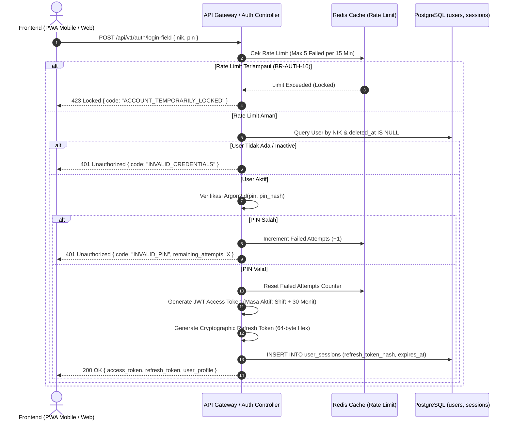

# Technical Requirements Document (TRD): API Autentikasi & Manajemen Sesi

---

## 1. Metadata Dokumen

| Properti | Keterangan |
| :--- | :--- |
| **Kode Dokumen** | `TRD-SEHS-01` |
| **Nama Modul** | Spesifikasi API Autentikasi & Manajemen Sesi (*Auth & Session API Contracts*) |
| **Protokol** | RESTful API over HTTPS (TLS 1.3) / JSON |
| **Source PRD (Acuan Bisnis)** | [`features/01-prd-auth-user.md`](../features/01-prd-auth-user.md) |
| **Depends On (Prasyarat)** | [`technical/01-dra-database-erd-master-auth.md`](./01-dra-database-erd-master-auth.md) (Tabel `users`, `user_sessions`) |
| **Consumed By (Dampak)** | Frontend Mobile PWA, Web Admin Dashboard, Backend Auth Gateway |
| **Versi** | 1.0.0 |
| **Status** | Approved / Baseline |
| **Terakhir Diperbarui** | 2026-09-14 |
| **Target Pembaca** | Backend Engineer, Frontend Engineer, Security Engineer, QA Automation |

---

## 2. Arsitektur Komponen & Diagram Alur Teknis

Sistem menggunakan arsitektur **Dual-Entry Authentication** dengan keluaran token terstandarisasi (JWT Access Token + Secure Refresh Token Rotation):



---

## 3. Spesifikasi Endpoint REST API

### 3.1 `POST /api/v1/auth/login-field`
* **Deskripsi:** Login cepat mobile untuk petugas lapangan (CS & Porter) menggunakan NIK dan PIN 6 digit.
* **Acuan Aturan Bisnis:** BR-AUTH-04, BR-AUTH-05, BR-AUTH-10.
* **Autentikasi:** Publik (Tanpa Token).
* **Headers:** `Content-Type: application/json`

#### Request Payload:
```json
{
  "nik": "10928374",
  "pin": "123456",
  "device_info": "Samsung Galaxy A14 / Android 13"
}
```

#### Response Success (`200 OK`):
```json
{
  "success": true,
  "data": {
    "access_token": "eyJhbGciOiJSUzI1NiIsInR5cCI6IkpXVCJ9...",
    "refresh_token": "a4f89b12e34c56d7890123456789abcdef0123456789abcdef0123456789abcdef",
    "token_type": "Bearer",
    "expires_in": 30600,
    "user": {
      "id": "7c9e6679-7425-40de-944b-e07fc1f90ae7",
      "nik": "10928374",
      "full_name": "Budi Santoso",
      "role": "FIELD_OFFICER",
      "unit": {
        "id": "a1b2c3d4-e5f6-7890-abcd-ef1234567890",
        "name": "Instalasi Rawat Inap"
      },
      "active_shift": {
        "id": "f5e4d3c2-b1a0-9876-5432-10fedcba0987",
        "name": "Shift Pagi",
        "start_time": "07:00",
        "end_time": "14:00"
      }
    }
  },
  "meta": {
    "timestamp": "2026-09-14T07:05:00Z",
    "request_id": "req_field_019a8b"
  }
}
```

#### Response Error (`401 Unauthorized` / `423 Locked`):
```json
{
  "success": false,
  "error": {
    "code": "AUTH_INVALID_PIN",
    "message": "PIN yang Anda masukkan salah.",
    "details": {
      "failed_attempts": 3,
      "max_attempts": 5,
      "remaining_attempts": 2
    }
  },
  "meta": {
    "timestamp": "2026-09-14T07:05:01Z",
    "request_id": "req_field_019a8c"
  }
}
```

---

### 3.2 `POST /api/v1/auth/login-web`
* **Deskripsi:** Login terstandar untuk staf pengawas, teknisi, dan manajemen di Web Admin Dashboard.
* **Acuan Aturan Bisnis:** BR-AUTH-06.
* **Autentikasi:** Publik.

#### Request Payload:
```json
{
  "email": "sanitarian@rs-sehat.co.id",
  "password": "PasswordKuat2026!",
  "remember_me": true
}
```

#### Response Success (`200 OK`):
```json
{
  "success": true,
  "data": {
    "access_token": "eyJhbGciOiJSUzI1NiIsInR5cCI6IkpXVCJ9...",
    "token_type": "Bearer",
    "expires_in": 28800,
    "user": {
      "id": "e3b0c442-98fc-1c14-9afb-f4c8996fb924",
      "nik": "20210089",
      "full_name": "Dr. Sarah Sanitarian, S.KL",
      "email": "sanitarian@rs-sehat.co.id",
      "role": "SANITARIAN",
      "unit": {
        "id": "b2c3d4e5-f6a7-8901-bcde-f23456789012",
        "name": "Instalasi Kesehatan Lingkungan"
      }
    }
  },
  "meta": {
    "timestamp": "2026-09-14T08:00:00Z",
    "request_id": "req_web_028b9c"
  }
}
```

---

### 3.3 `POST /api/v1/auth/refresh`
* **Deskripsi:** Memperbarui JWT Access Token menggunakan Refresh Token sebelum kedaluwarsa (*Silent Token Refresh*).
* **Autentikasi:** Refresh Token (via Body atau Secure HttpOnly Cookie).

#### Request Payload:
```json
{
  "refresh_token": "a4f89b12e34c56d7890123456789abcdef0123456789abcdef0123456789abcdef"
}
```

#### Response Success (`200 OK`):
```json
{
  "success": true,
  "data": {
    "access_token": "eyJhbGciOiJSUzI1NiIsInR5cCI6IkpXVCJ9_NEW_TOKEN...",
    "refresh_token": "b5e98a12e45c67d890123456789abcdef0123456789abcdef0123456789abcdef_ROTATED...",
    "expires_in": 30600
  },
  "meta": {
    "timestamp": "2026-09-14T11:30:00Z",
    "request_id": "req_ref_039c1d"
  }
}
```

---

### 3.4 `POST /api/v1/auth/logout`
* **Deskripsi:** Mengakhiri sesi aktif dan mencabut (*revoke*) refresh token di database.
* **Autentikasi:** Wajib menyertakan `Authorization: Bearer <access_token>`.

#### Request Payload:
```json
{
  "refresh_token": "a4f89b12e34c56d7890123456789abcdef0123456789abcdef0123456789abcdef"
}
```

#### Response Success (`200 OK`):
```json
{
  "success": true,
  "data": {
    "message": "Sesi berhasil diakhiri. Logout sukses."
  },
  "meta": {
    "timestamp": "2026-09-14T14:15:00Z",
    "request_id": "req_logout_040d2e"
  }
}
```

---

### 3.5 `PUT /api/v1/auth/change-pin`
* **Deskripsi:** Penggantian PIN mandiri oleh petugas lapangan.
* **Autentikasi:** Bearer Token (`FIELD_OFFICER`).

#### Request Payload:
```json
{
  "old_pin": "123456",
  "new_pin": "987654",
  "confirm_new_pin": "987654"
}
```

#### Response Success (`200 OK`):
```json
{
  "success": true,
  "data": {
    "message": "PIN berhasil diperbarui. Silakan gunakan PIN baru untuk sesi berikutnya."
  }
}
```

---

### 3.6 `POST /api/v1/admin/users/:id/reset-pin`
* **Deskripsi:** Bantuan darurat oleh Sanitarian untuk menyetel ulang PIN petugas yang lupa PIN.
* **Acuan Aturan Bisnis:** BR-AUTH-09.
* **Autentikasi:** Bearer Token (`SANITARIAN` / Admin).

#### Request Payload:
```json
{
  "temporary_pin": "123456",
  "require_change_on_next_login": true
}
```

#### Response Success (`200 OK`):
```json
{
  "success": true,
  "data": {
    "user_id": "7c9e6679-7425-40de-944b-e07fc1f90ae7",
    "message": "PIN sementara berhasil dipasang. Petugas wajib mengganti PIN saat login."
  }
}
```

---

## 4. Spesifikasi Keamanan, Kriptografi & Token (Security Spec)

### 4.1 Standar Hashing Kredensial
* **Password Hashing (Web Login):** Menggunakan algoritma **Argon2id**:
  * Memory Cost: `65536 KB (64 MB)`
  * Time Cost / Iterations: `3`
  * Parallelism: `4 lanes`
* **PIN 6 Digit Hashing (Mobile Login):**
  * PIN di-hash menggunakan Argon2id dengan *salt* kriptografis unik berukuran 16-byte per pengguna.

### 4.2 Struktur Payload JWT Access Token
Access Token ditandatangani menggunakan algoritma asimetris **RS256** (Private Key di Auth Server, Public Key di API Gateway):
```json
{
  "sub": "7c9e6679-7425-40de-944b-e07fc1f90ae7",
  "nik": "10928374",
  "name": "Budi Santoso",
  "role": "FIELD_OFFICER",
  "unit_id": "a1b2c3d4-e5f6-7890-abcd-ef1234567890",
  "shift_id": "f5e4d3c2-b1a0-9876-5432-10fedcba0987",
  "iss": "https://auth.sehs-hospital.id",
  "aud": "https://api.sehs-hospital.id",
  "iat": 1789456800,
  "exp": 1789487400
}
```

### 4.3 Refresh Token Rotation (RTR)
* Setiap kali endpoint `/auth/refresh` dipanggil, server mengeluarkan pasang token baru:
  1. Access Token baru.
  2. Refresh Token baru (*Rotated*).
  3. Refresh Token lama langsung ditandai `is_revoked = true` di database.
* **Pencegahan Pencurian Token (*Token Reuse Detection*):** Jika refresh token yang sudah di-revoke dicoba digunakan kembali, sistem menganggap sesi tersebut telah dibajak dan seketika **mencabut seluruh sesi aktif milik user tersebut**.

---

## 5. Matriks Kode Error Standar (Error Reference)

| HTTP Status | Error Code | Pesan User | Penjelasan Teknis |
| :---: | :--- | :--- | :--- |
| `401` | `AUTH_INVALID_CREDENTIALS` | "Email atau kata sandi salah." | Kombinasi email & password tidak cocok di DB. |
| `401` | `AUTH_INVALID_PIN` | "PIN salah. Sisa percobaan: X." | Hash PIN tidak cocok. |
| `401` | `AUTH_TOKEN_EXPIRED` | "Sesi kerja Anda telah kedaluwarsa." | JWT exp timestamp telah terlampaui. |
| `403` | `AUTH_ACCOUNT_INACTIVE` | "Akun Anda telah dinonaktifkan. Hubungi Sanitarian." | User status bernilai `INACTIVE` atau `SUSPENDED`. |
| `423` | `AUTH_ACCOUNT_LOCKED` | "Akun terkunci 15 menit akibat 5x salah PIN." | Akun mencapai batas toleransi brute-force. |
| `422` | `AUTH_PIN_FORMAT_INVALID` | "PIN harus berupa 6 digit angka." | Validasi regex `^[0-9]{6}$` gagal. |
