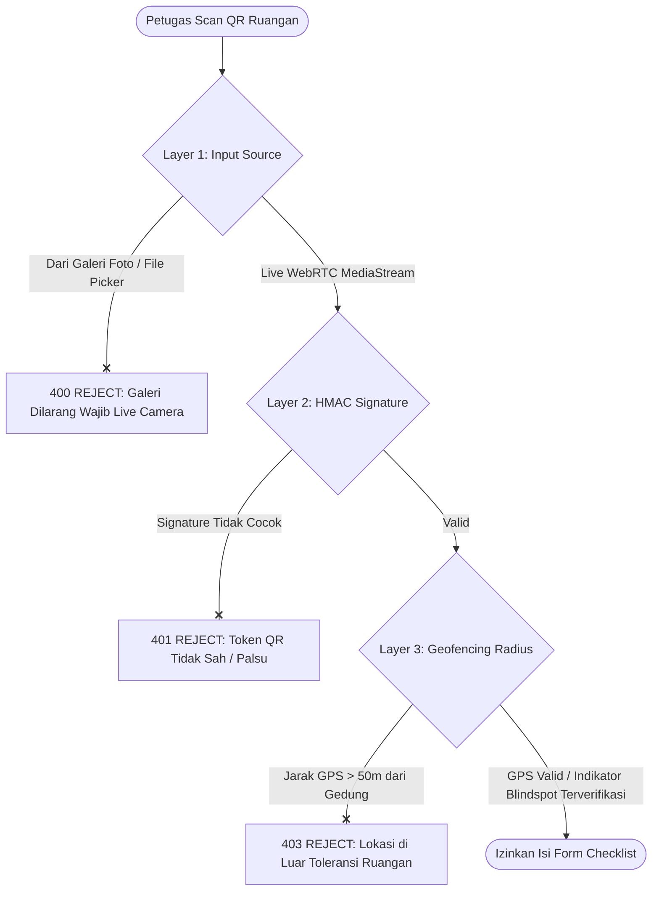
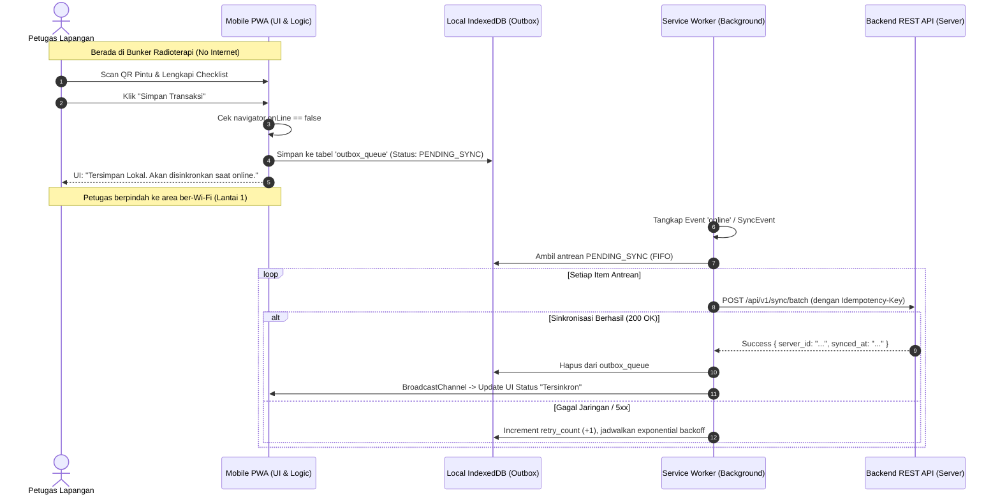

# Technical Requirements Document (TRD): Keamanan QR Code, Anti-Kloning & Arsitektur Offline-First (Flutter & PWA)

---

## 1. Metadata Dokumen

| Properti | Keterangan |
| :--- | :--- |
| **Kode Dokumen** | `TRD-SEHS-03` |
| **Nama Modul** | Spesifikasi Keamanan QR Code, Validasi Anti-Kloning & Arsitektur Sinkronisasi Offline (Flutter Mobile & PWA) |
| **Protokol** | HTTPS (TLS 1.3), Web Crypto / Flutter Security, SQLite/Hive/IndexedDB Outbox |
| **Source PRD (Acuan Bisnis)** | • [`features/01-prd-auth-user.md`](../features/01-prd-auth-user.md)<br>• [`features/master-data/02-md-fasilitas-ruangan-qr.md`](../features/master-data/02-md-fasilitas-ruangan-qr.md)<br>• [`features/operational/01-prd-checklist-kebersihan-qr.md`](../features/operational/01-prd-checklist-kebersihan-qr.md) |
| **Depends On (Prasyarat)** | • [`technical/01-dra-database-erd-master-auth.md`](./01-dra-database-erd-master-auth.md) (Tabel `rooms`, `users`, `user_sessions`)<br>• [`technical/02-trd-auth-session-api.md`](./02-trd-auth-session-api.md) (JWT Bearer Token & Device Info) |
| **Consumed By (Dampak)** | Frontend Mobile Flutter App, Frontend Web Admin Dashboard, Backend QR Service, Audit Log Engine |
| **Versi** | 1.1.0 |
| **Status** | Approved / Baseline |
| **Terakhir Diperbarui** | 2026-09-14 |
| **Target Pembaca** | Mobile Flutter Engineer, Frontend Web Engineer, Backend Security Specialist, Sanitarian Auditor |

---

## 2. Latar Belakang & Masalah Arsitektur

Pada operasional sanitasi fasilitas pelayanan kesehatan (Rumah Sakit), terdapat dua tantangan teknis kritis di lapangan:

1. **Risiko Pemalsuan Kehadiran Lapangan (*Attendance / Cleaning Spoofing*):**
   * Stiker QR fisik di pintu ruangan rentan difoto oleh petugas, lalu dicetak ulang atau dibagikan melalui grup chat untuk di-scan dari jarak jauh tanpa pernah mendatangi ruangan.
   * *Solusi Teknis:* Enkripsi token QR berbasis kriptografi HMAC-SHA256, penguncian validasi koordinat GPS/Geofencing faskes (toleransi ~30 meter), serta pemblokiran upload gambar dari galeri kamera (*live camera stream only*).

2. **Area *Blind-Spot* Sinyal Seluler / Wi-Fi di Rumah Sakit:**
   * Petugas kebersihan dan porter limbah sering bekerja di area terisolasi seperti *Basement*, Bunker Radioterapi (berlapis timbal/timah), Ruang Jenazah, atau TPS Limbah B3 di belakang gedung yang tidak terjangkau Wi-Fi.
   * *Solusi Teknis:* Arsitektur **Offline-First PWA** menggunakan Service Worker Cache untuk aset UI, IndexedDB lokal untuk menyimpan template dan antrean transaksi (*Outbox Queue*), serta mekanisme *Background Sync* otomatis dengan penjamin integritas *Idempotency-Key*.

---

## 3. Arsitektur Kriptografi & Format QR Code

### 3.1 Struktur Muatan Token QR Fisik Ruangan (*Static Door QR*)

Stiker QR fisik yang ditempel di pintu ruangan memuat string terstruktur terenkripsi dan bertanda-tangan digital:

```text
SEHS:v1:<room_id>:<facility_id>:<salt>:<hmac_signature>
```

Contoh string isi QR Code:
```text
SEHS:1:c3d4e5f6-a7b8-9012-cdef-123456789012:RS-SBY-01:9f2c8d1a:3e6b9a80e12d4a5b6c7d8e9f0123456789abcdef0123456789abcdef01234567
```

#### Komponen Muatan:
| Komponen | Tipe Data | Deskripsi |
| :--- | :--- | :--- |
| `prefix` | String | Identifier sistem SEHS: `SEHS` |
| `version` | Integer | Versi protokol payload: `1` |
| `room_id` | UUIDv4 | ID entitas ruangan di database |
| `facility_id` | String | Kode fasilitas rumah sakit (multi-tenant identifier) |
| `salt` | 8-byte Hex | Nilai pengacak unik yang dihasilkan saat QR digenerate |
| `hmac_signature` | 64-byte Hex | Tanda tangan HMAC-SHA256 server menggunakan Server Secret Key |

### 3.2 Rumus Perhitungan HMAC-SHA256 Server
Saat Sanitarian mencetak stiker QR via web dashboard, server menghitung:
$$\text{Signature} = \text{HMAC-SHA256}\Big(K_{\text{facility\_secret}}, \quad \text{"room\_id:facility\_id:salt"}\Big)$$

* **Kunci Rahasia ($K_{\text{facility\_secret}}$):** Disimpan di Vault / HSM / Environment Variable terenkripsi, tidak pernah diekspos ke klien mobile.
* **Deteksi Modifikasi:** Jika ada pihak yang memodifikasi `room_id` pada QR, signature tidak cocok dan scanner langsung menolak data.

---

## 4. Mekanisme Anti-Kloning & Validasi Kehadiran Fisik

Sistem menerapkan validasi berlapis 3 tingkat (*3-Layer Physical Verification*) sebelum checklist ruangan diizinkan untuk dibuka:



### 4.1 Layer 1: Blokir Akses Galeri Klien (*Hardware Camera Enforcement*)
* Aplikasi PWA menggunakan HTML5 `navigator.mediaDevices.getUserMedia({ video: { facingMode: 'environment' } })` langsung pada elemen `<video>`.
* Komponen `<input type="file" accept="image/*">` **dilarang keras** untuk modul scan ruangan guna mencegah petugas mengunggah screenshot QR yang dikirimkan melalui WhatsApp/Telegram.

### 4.2 Layer 2: Validasi Geofencing & Koordinat GPS
* Saat scan berhasil, PWA menangkap koordinat perangkat:
  * Latitude & Longitude dari `navigator.geolocation.getCurrentPosition()`.
  * Akurasi GPS (`accuracy` dalam meter).
* Server memverifikasi jarak perangkat terhadap titik koordinat gedung fasilitas (`building.latitude`, `building.longitude`) menggunakan formula **Haversine**:
  $$d = 2r \arcsin\left(\sqrt{\sin^2\left(\frac{\Delta\phi}{2}\right) + \cos(\phi_1)\cos(\phi_2)\sin^2\left(\frac{\Delta\lambda}{2}\right)}\right)$$
* **Toleransi:** Maksimal 50 meter dari centroid gedung faskes.
* **Pengecualian Ruangan Bunker/Basement (GPS Blind-Spot):**
  * Jika ruangan terdaftar memiliki atribut `is_gps_blindspot = TRUE` di master data, kegagalan sinyal GPS (`TIMEOUT` atau `ACCURACY > 100m`) ditoleransi dengan catatan log audit `"GPS_DEGRADED_PERMITTED"`.

---

## 5. Arsitektur Offline-First & Sinkronisasi Data (Flutter Mobile & PWA)

Untuk menjamin petugas dapat terus mencatat kebersihan dan limbah di area tanpa koneksi internet (seperti Bunker Radioterapi atau Basement), sistem menggunakan arsitektur **Local-First / Outbox Pattern**:

* **Pada Klien Flutter Mobile (Aplikasi Utama Petugas):**
  * **Penyimpanan Kredensial:** Disimpan di Android Keystore / iOS Keychain menggunakan `flutter_secure_storage`.
  * **Database Lokal Offline:** Menggunakan **SQLite (sqflite) / Isar / Hive** untuk menampung tabel `cached_templates` dan `outbox_queue`.
  * **Hardware Scanning:** Menggunakan plugin `mobile_scanner` (direct camera stream).
  * **Pendeteksi Jaringan:** Menggunakan `connectivity_plus` dan background retry worker.
* **Pada Klien Web PWA (Fallback Mobile Web):**
  * Menggunakan Service Worker Cache Storage & browser IndexedDB.

---

### 5.1 Skema Penyimpanan Outbox Lokal (SQLite / Isar / IndexedDB)

Struktur tabel / *Object Store* antrean transaksi lokal (`outbox_queue`):



### 5.1 Skema Penyimpanan Lokal (IndexedDB Object Stores)

PWA menginisialisasi database IndexedDB bernama `sehs_offline_db` (versi 1) dengan 3 *Object Stores*:

#### 1. Store: `cached_templates`
* Menyimpan template checklist dan daftar ruangan agar form bisa dirender tanpa internet.
* Key: `room_id` (String).
* Nilai: JSON array indikator kebersihan, passing grade, bobot, dan nama ruangan.
* Strategi Cache: Di-refresh setiap kali user login atau shift dimulai.

#### 2. Store: `outbox_queue`
* Menyimpan transaksi yang belum terkirim ke server.
* Key: `idempotency_key` (UUIDv4).
* Struktur Dokumen:
```json
{
  "idempotency_key": "9b1deb4d-3b7d-4bad-9bdd-2b0d7b3dcb6d",
  "endpoint": "/api/v1/operational/checklists",
  "http_method": "POST",
  "payload": {
    "room_id": "c3d4e5f6-a7b8-9012-cdef-123456789012",
    "scanned_at": "2026-09-14T21:30:15Z",
    "scores": [
      { "indicator_id": "b1c2d3...", "is_passed": true, "note": null }
    ],
    "geo_snapshot": { "lat": -7.2575, "lng": 112.7521, "accuracy": 12.5 }
  },
  "created_at": 1789467015000,
  "retry_count": 0,
  "status": "PENDING_SYNC"
}
```

#### 3. Store: `offline_photos`
* Menyimpan file foto bukti kerusakan/kondisi ruangan dalam format `Blob` sebelum di-upload saat online.
* Key: `photo_id` (UUIDv4).

### 5.2 Strategi Caching Service Worker (Cache Storage)

| Kategori Aset | Pola URL | Strategi Caching | Penjelasan |
| :--- | :--- | :--- | :--- |
| **App Shell** | `/index.html`, `/assets/*.js`, `/assets/*.css` | **Stale-While-Revalidate** | Menjamin aplikasi langsung terbuka instan, pembaruan diunduh di latar belakang. |
| **Pustaka Ikon & Font** | `fonts.googleapis.com`, `/icons/*` | **Cache-First (TTL 30 hari)** | Font dan logo rumah sakit sangat jarang berubah. |
| **Data Master Ruangan** | `/api/v1/master/rooms*` | **Network-First dengan Fallback IDB** | Selalu coba ambil data terkini; jika offline gunakan cache IndexedDB. |
| **Aksi Transaksi POST** | `/api/v1/operational/*` | **Network-Only (Diproteksi Outbox)** | Jangan cache via SW HTTP Cache; serahkan ke `outbox_queue` IndexedDB. |

---

## 6. Spesifikasi Endpoint Sinkronisasi & Verifikasi QR

### 6.1 `POST /api/v1/qr/verify`
* **Deskripsi:** Memvalidasi keaslian signature token QR ruangan sebelum petugas membuka form checklist.
* **Autentikasi:** Bearer Token (Semua peran lapangan).

#### Request Payload:
```json
{
  "qr_payload": "SEHS:1:c3d4e5f6-a7b8-9012-cdef-123456789012:RS-SBY-01:9f2c8d1a:3e6b9a80e12d...",
  "device_lat": -7.257512,
  "device_lng": 112.752145,
  "accuracy_meters": 8.5
}
```

#### Response Success (`200 OK`):
```json
{
  "success": true,
  "data": {
    "room_id": "c3d4e5f6-a7b8-9012-cdef-123456789012",
    "room_code": "OK-01",
    "room_name": "Kamar Operasi Bedah Mayor 1",
    "unit_name": "Instalasi Bedah Sentral",
    "risk_level": "VERY_HIGH",
    "active_template": {
      "template_id": "e4f5a6b7-c8d9-0123-ef01-456789abcdef",
      "passing_grade": 85.00,
      "indicators_count": 12
    },
    "verification_token": "VT_signed_7a8b9c0d1e2f..."
  },
  "meta": {
    "timestamp": "2026-09-14T21:40:00Z"
  }
}
```

---

### 6.2 `POST /api/v1/sync/batch`
* **Deskripsi:** Endpoint pengiriman massal untuk item yang tertunda di *Outbox Queue* saat koneksi pulih kembali.
* **Autentikasi:** Bearer Token.
* **Headers:** `Idempotency-Key: <UUID>`

#### Request Payload:
```json
{
  "batch_items": [
    {
      "idempotency_key": "9b1deb4d-3b7d-4bad-9bdd-2b0d7b3dcb6d",
      "transaction_type": "ROOM_CHECKLIST",
      "recorded_at_client": "2026-09-14T21:30:15Z",
      "payload": {
        "room_id": "c3d4e5f6-a7b8-9012-cdef-123456789012",
        "scores": [
          { "indicator_id": "ind-01", "is_passed": true },
          { "indicator_id": "ind-02", "is_passed": false, "note": "Kaca jendela berdebu" }
        ]
      }
    }
  ]
}
```

#### Response Success (`200 OK`):
```json
{
  "success": true,
  "data": {
    "processed_count": 1,
    "results": [
      {
        "idempotency_key": "9b1deb4d-3b7d-4bad-9bdd-2b0d7b3dcb6d",
        "status": "COMMITTED",
        "server_record_id": "f1e2d3c4-b5a6-7890-1234-56789abcdef0",
        "message": "Data berhasil dibukukan."
      }
    ]
  },
  "meta": {
    "synced_at": "2026-09-14T21:42:10Z"
  }
}
```

---

## 7. Kebijakan Rekonsiliasi Bentrok & Penanganan Waktu (*Conflict & Clock Drift*)

1. **Jaminan Idempoten (*Idempotency Guarantee*):**
   * Server menyimpan setiap `idempotency_key` di tabel transaksi atau Redis selama 7 hari.
   * Jika item outbox terkirim dua kali karena gangguan jaringan sesaat sebelum response diterima klien, server mengembalikan data transaksi yang sudah ada tanpa melakukan duplikasi baris database.

2. **Deteksi Manipulasi Jam Perangkat (*Client Clock Drift Handling*):**
   * Setiap payload outbox menyertakan `recorded_at_client`.
   * Server membandingkan `recorded_at_client` dengan waktu server `NOW()`.
   * Jika selisih waktu klien lebih dari **15 menit** ke masa depan atau lebih dari **24 jam** ke masa lalu tanpa bukti status offline, transaksi ditandai dengan peringatan audit `AUDIT_FLAG_SUSPICIOUS_TIMESTAMP` untuk diverifikasi oleh Sanitarian.

3. **Urutan Pemrosesan Antrean (*FIFO Order*):**
   * Sinkronisasi outbox selalu memproses transaksi berdasarkan urutan waktu `created_at` ASC (First-In, First-Out) agar status riwayat ruangan tetap kronologis.
